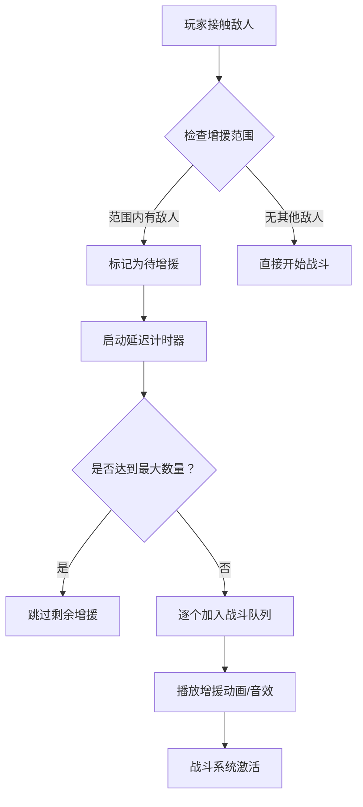
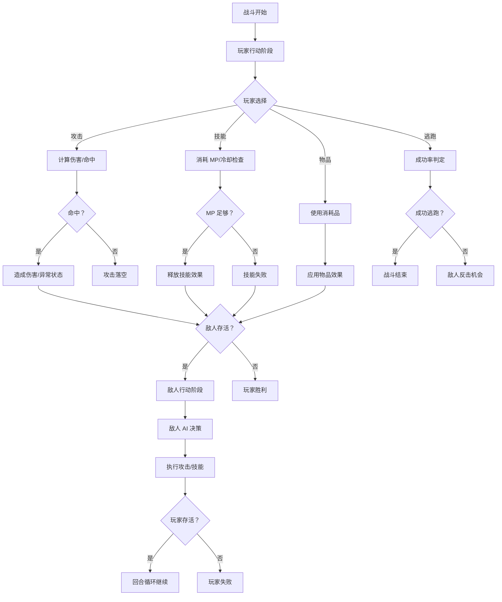
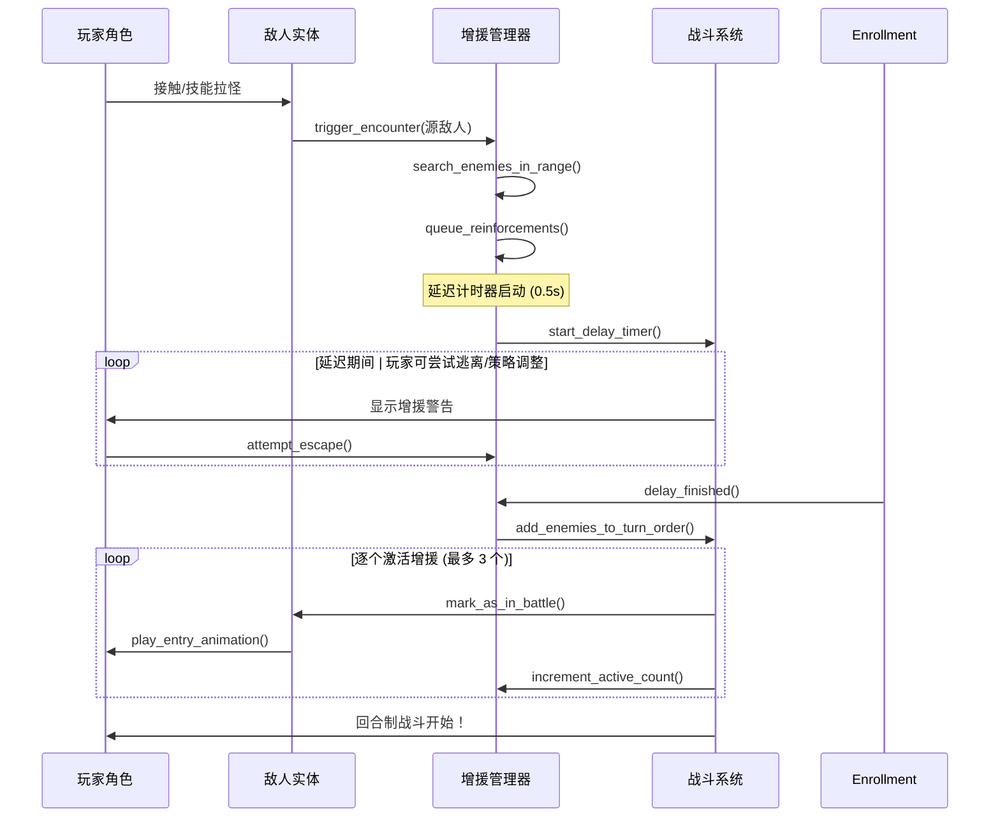

# 🎮 地下城探索游戏 - 完整玩法详细设计文档

**项目名称:** Dungeon Extraction Game (地牢搜打撤)  
**版本:** v1.0 (完整版策划案)  
**日期:** 2026-03-18  
**作者:** 中书 🐉 (首席策划官 & 剧情设计大师)  
**审核状态:** ✅ BOSS 已审阅确认 - 可进入开发准备  
**适用阶段:** Core Game Loop Foundation

---

## 📑 目录结构

1. [第一章：大地图系统架构](#一-大地图系统架构)
2. [第二章：即时探索与触发机制 ← 核心亮点！](#二-即时探索与触发机制)
3. [第三章：回合制战斗框架](#三-回合制战斗框架)
4. [第四章：资源循环与经济模型](#四-资源循环与经济模型)
5. [第五章：撤离机制](#五-撤离机制)
6. [第六章：剧情演绎兼容框架](#六-剧情演绎兼容框架)

---

## 一、大地图系统架构

### 🗺️ 1.1 系统概述与设计理念

**核心理念:**  
> "以基地为核心，通过探索地下城获取资源，建设强化角色，形成良性循环"

**设计目标:**
- ✅ **清晰的空间认知:** 玩家能明确区分不同功能区域
- ✅ **流畅的地点切换:** 减少加载等待时间，保持游戏节奏
- ✅ **深度互动体验:** NPC、建筑、环境都有叙事价值

### 1.2 基地系统详解

#### 1.2.1 基地核心功能模块

| 建筑类型 | 主要功能 | 升级效果 | 解锁条件 | 人口需求 |
|----------|----------|----------|----------|----------|
| **主堡** | 游戏存档点、任务接取处 | 扩展仓库容量、解锁新功能 | 初始建筑 | 50 人 |
| **兵营** | 招募 NPC 士兵、训练战斗单位 | 提升士兵战斗力、解锁特殊兵种 | 主堡 Lv.2 | 100 人 |
| **铁匠铺** | 装备强化、武器锻造 | 解锁稀有配方、提升成功率 | 主堡 Lv.3 | 80 人 |
| **炼金塔** | 制作消耗品、研究新技能 | 解锁高级配方、缩短制作时间 | 主堡 Lv.4 | 120 人 |
| **仓库** | 物资存储、道具管理 | 扩大存储空间、自动分类整理 | 初始建筑 | 30 人 |
| **瞭望塔** | 侦察地下城情况、显示怪物分布 | 解锁更远距离视野、标记稀有资源 | 主堡 Lv.5 | 150 人 |

#### 1.2.2 人口管理系统

**人口来源与消耗:**

```gdscript
class PopulationManager:
    var current_population := 0
    var max_capacity := 100
    
    # NPC 招募流程
    func recruit_npc(npc_type: String, cost_gold: int) -> bool:
        if current_population >= max_capacity:
            return false
        
        # 检查建筑等级是否满足要求
        if not has_required_buildings(npc_type):
            return false
        
        # 扣除金币并增加人口
        game.gold -= cost_gold
        current_population += 1
        
        # NPC 分配到对应建筑工作
        assign_npc_to_building(npc_type)
        
        return true
    
    # 建筑人口需求检查
    func has_required_buildings(npc_type: String) -> bool:
        match npc_type:
            "soldier":
                return building_manager.get_level("barracks") >= 2
            "blacksmith":
                return building_manager.get_level("forge") >= 3
            "alchemist":
                return building_manager.get_level("alchemy_tower") >= 4
        
        return false

# NPC 对话触发机制
func trigger_npc_dialogue(npc_id: String):
    var dialogue_tree := load_dialogue_tree(npc_id)
    
    # 检查对话条件
    if not check_dialogue_conditions(npc_id):
        show_generic_greeting()
        return
    
    # 显示个性化对话
    show_special_dialogue(dialogue_tree, get_npc_relationship(npc_id))

# NPC 关系系统 (影响对话内容和任务难度)
var npc_relationships: Dictionary = {}

func update_npc_relationship(npc_id: String, delta: int):
    if not npc_relationships.has(npc_id):
        npc_relationships[npc_id] = 50  # 初始中立值
    
    var new_value := clamp(npc_relationships[npc_id] + delta, 0, 100)
    npc_relationships[npc_id] = new_value

# 关系等级划分:
# - 0~20: 敌对 (NPC 拒绝交易，可能攻击玩家)
# - 21~49: 冷淡 (正常交易但无折扣)
# - 50~79: 友好 (提供价格优惠，解锁隐藏任务)
# - 80~100: 信赖 (特殊对话，赠送稀有物品)
```

#### 1.2.3 NPC 对话系统脚本格式

**对话树结构定义:**

```json
{
    "dialogue_id": "blacksmith_intro",
    "npc_id": "blacksmith_master_kael",
    "relationship_threshold": 50,
    "branches": [
        {
            "trigger_condition": "first_meeting",
            "lines": [
                {
                    "speaker": "Kael",
                    "text": "欢迎来到铁匠铺，冒险者。有什么需要帮助的吗？",
                    "expression": "neutral"
                },
                {
                    "speaker": "Player",
                    "choices": [
                        {"text": "我想强化装备", "next_branch": "forge_service"},
                        {"text": "你在做什么？", "next_branch": "work_description"},
                        {"text": "再见", "action": "close_dialogue"}
                    ]
                }
            ]
        },
        {
            "trigger_condition": "relationship_>=50",
            "lines": [
                {
                    "speaker": "Kael",
                    "text": "老朋友，今天想打造什么武器？我最近研究出几个新配方。",
                    "expression": "warm"
                }
            ]
        }
    ],
    "rewards": {
        "type": "discount",
        "value": 0.15,
        "duration": "permanent"
    }
}
```

**对话执行引擎 (GDScript):**

```gdscript
class DialogueEngine:
    var current_dialogue_tree: Dictionary = {}
    var player_choice_index := 0
    
    func start_dialogue(dialogue_id: String):
        current_dialogue_tree = load_json("dialogues/" + dialogue_id + ".json")
        
        # 检查关系阈值
        if not check_relationship_threshold():
            return false
        
        show_npc_sprite(current_dialogue_tree["npc_id"])
        display_line_stack(current_dialogue_tree.branches[0].lines)
        
        return true
    
    func display_line_stack(lines: Array):
        for line in lines:
            var label := create_speech_label(line.speaker, line.text)
            
            # 根据表情调整 NPC 面部动画
            if line.has("expression"):
                animate_npc_face(line.expression)
            
            add_child(label)
    
    func show_choices(choices: Array):
        for choice in choices:
            var button := create_choice_button(choice.text)
            button.pressed.connect(_on_choice_selected.bind(choice))
            choices_container.add_child(button)
    
    func _on_choice_selected(choice: Dictionary, action_type: String):
        match action_type:
            "next_branch":
                player_choice_index = choice.next_branch
                display_dialogue_branch(current_dialogue_tree.branches[choice.next_branch])
            
            "close_dialogue":
                close_dialogue_ui()
                return
            
            "reward_grant":
                grant_reward(choice.rewards)

# 对话条件检查函数
func check_dialogue_conditions(npc_id: String) -> bool:
    var dialogue_data := get_npc_dialogue_data(npc_id)
    
    # 检查关系阈值
    if npc_relationships.get(npc_id, 0) < dialogue_data.relationship_threshold:
        return false
    
    # 检查任务进度
    if dialogue_data.has("quest_requirement"):
        if not quest_manager.is_quest_completed(dialogue_data.quest_requirement):
            return false
    
    return true

# NPC 表情系统 (影响对话氛围)
enum NPCExpression {
    neutral,      # 正常交流
    warm,         # 友好热情
    serious,      # 严肃认真
    concerned,    # 担忧焦虑
    angry,        # 愤怒敌对
    sad           # 悲伤失落
}

func animate_npc_face(expression: NPCExpression):
    var sprite := $NPCSprite
    var animation_name := "face_" + NPCExpression.keys()[expression]
    
    if sprite.has_animation(animation_name):
        sprite.play(animation_name)
```

### 1.3 地下城入口机制

#### 1.3.1 入口类型与解锁条件

| 入口名称 | 位置 | 解锁条件 | 难度等级 | 特殊说明 |
|----------|------|----------|----------|----------|
| **新手地牢** | 基地西侧 | 初始解锁 | Lv.1-3 | 怪物稀少，适合熟悉机制 |
| **废弃矿坑** | 森林边缘 | 主堡 Lv.3 | Lv.4-6 | 富含矿石资源 |
| **古遗迹** | 沙漠深处 | 瞭望塔 Lv.2 | Lv.7-9 | 可能有古代机关 |
| **深渊裂隙** | 火山口 | 完成主线任务 | Lv.10+ | Boss 战区域 |

#### 1.3.2 入口切换逻辑

```gdscript
class DungeonEntranceManager:
    var current_dungeon_type := "beginner"
    var player_level := 1
    
    func enter_dungeon(dungeon_id: String):
        # 检查解锁条件
        if not is_unlocked(dungeon_id):
            show_error("该地牢尚未解锁！请提升主堡等级或完成前置任务")
            return
        
        # 检查玩家等级是否满足要求
        var min_level := get_dungeon_min_level(dungeon_id)
        if player_level < min_level:
            show_warning("建议玩家等级达到 %d 后再进入" % min_level)
        
        # 加载地下城场景
        load_dungeon_scene(dungeon_id)
        
        # 重置地下城状态
        reset_dungeon_state()
    
    func is_unlocked(dungeon_id: String) -> bool:
        match dungeon_id:
            "beginner":
                return true
            
            "abandoned_mine":
                return building_manager.get_level("main_keep") >= 3
            
            "ancient_ruins":
                return building_manager.get_level("watchtower") >= 2
            
            "abyssal_chasm":
                return quest_manager.is_quest_completed("main_story_chapter_1")
        
        return false
    
    func reset_dungeon_state():
        # 重置地牢层级计数器
        current_layer := 0
        
        # 重置任务计时器
        session_timer.start()
        
        # 生成随机任务
        quest_generator.generate_random_quest()

# 地下城加载流程 (优化体验，减少等待)
func load_dungeon_scene(dungeon_id: String):
    var scene_path := "res://scenes/dungeons/" + dungeon_id + ".tscn"
    
    # 预加载资源
    preload_resources(scene_path)
    
    # 显示加载界面
    show_loading_screen()
    
    # 异步加载场景
    var scene = load(scene_path)
    var instance = scene.instantiate()
    
    get_tree().current_scene.add_child(instance)
    get_tree().change_scene_to_packed(scene)

# 预加载资源函数 (减少卡顿)
func preload_resources(scene_path: String):
    ResourceLoader.load_threaded_request(scene_path)
    
    while ResourceLoader.load_threaded_get_status(scene_path) == ResourceLoader.THREAD_LOAD_IN_PROGRESS:
        get_tree().process()
        await get_tree().create_timer(0.1).timeout
    
    show_loading_complete()
```

### 1.4 中立城镇交易功能

#### 1.4.1 城镇结构与功能分布

**地图布局:**
```
[集市广场] ← 玩家初始到达区域
├── [铁匠铺] - 装备购买/强化
├── [药剂店] - 消耗品交易
├── [情报屋] - 任务接取/消息更新
└── [旅馆] - 休息恢复/住宿服务

[住宅区] (需解锁)
├── [NPC 住所] - 深度对话/特殊任务
└── [仓库租赁处] - 扩展存储
```

#### 1.4.2 交易机制详解

**商品价格公式:**

```gdscript
class TradeSystem:
    var base_price := 100
    var relationship_discount := 0.0  # NPC 关系折扣 (最大 30%)
    var market_fluctuation := 0.1     # 市场波动系数
    
    func calculate_item_price(item_id: String, quantity: int) -> float:
        # 基础价格 × 数量
        var base_total := get_base_price(item_id) * quantity
        
        # NPC 关系折扣
        var npc_id := get_trader_npc_id()
        var relationship_level := clamp(npc_relationships.get(npc_id, 50), 0, 100)
        var discount_rate := (relationship_level - 50) / 166.67  # 简化计算
        
        base_total *= (1.0 - discount_rate)
        
        # 市场波动 (随机 ±10%)
        var fluctuation_factor := 1.0 + randf_range(-market_fluctuation, market_fluctuation)
        
        return int(base_total * fluctuation_factor)

# 物品稀有度定价表
enum Rarity {
    COMMON,       # 普通 - 基础价格 × 1
    UNCOMMON,     # 罕见 - 基础价格 × 3
    RARE,         # 稀有 - 基础价格 × 10
    EPIC,         # 史诗 - 基础价格 × 50
    LEGENDARY     # 传奇 - 基础价格 × 200
}

func get_base_price(item_id: String) -> float:
    var item_data := get_item_database()[item_id]
    
    match item_data.rarity:
        Rarity.COMMON:
            return item_data.base_value * 1.0
        
        Rarity.UNCOMMON:
            return item_data.base_value * 3.0
        
        Rarity.RARE:
            return item_data.base_value * 10.0
        
        Rarity.EPIC:
            return item_data.base_value * 50.0
        
        Rarity.LEGENDARY:
            return item_data.base_value * 200.0
    
    return item_data.base_value

# 交易界面 UI 实现
class TradeUI extends CanvasLayer:
    var trader_npc: String = ""
    var selected_item_id := ""
    
    func open_trading_window(npc_id: String, inventory_items: Array):
        trader_npc = npc_id
        
        # 清空旧物品列表
        $ItemList.clear()
        
        # 填充可交易物品
        for item in inventory_items:
            var price := calculate_item_price(item.id, item.quantity)
            
            var item_button := create_trade_item_button(
                name=item.name,
                icon=item.icon,
                price=price,
                quantity=item.quantity
            )
            
            $ItemList.add_child(item_button)

# 购买/出售逻辑
func execute_transaction(transaction_type: String, item_id: String, quantity: int):
    var price := calculate_item_price(item_id, quantity)
    
    match transaction_type:
        "buy":
            if game.gold < price:
                show_error("金币不足！")
                return false
            
            # 扣除金币，添加物品到背包
            game.gold -= price
            player_inventory.add_item(item_id, quantity)
            
            show_success("购买成功！花费 %d 金币" % price)
            
        "sell":
            if not player_inventory.has_item(item_id, quantity):
                show_error("库存不足！")
                return false
            
            # 扣除物品，增加金币
            player_inventory.remove_item(item_id, quantity)
            game.gold += int(price * 0.8)  # 出售价格打八折
            
            show_success("出售成功！获得 %d 金币" % int(price * 0.8))

# NPC 关系对交易的影响
func apply_relationship_effect(npc_id: String):
    var relationship := npc_relationships.get(npc_id, 50)
    
    if relationship >= 80:
        # 信赖等级：解锁隐藏商品，价格再降 10%
        unlock_hidden_items()
        apply_additional_discount(0.10)
        
        show_dialogue("Kael", "老朋友，这些稀有材料就卖给你吧！")
    
    elif relationship >= 50:
        # 友好等级：提供常规折扣
        apply_regular_discount(0.15)
        
        show_dialogue("Kael", "老朋友，今天想打造什么武器？我最近研究出几个新配方。")

```

### 1.5 地点间切换逻辑

#### 1.5.1 场景转换机制

**设计原则:** 快速切换 + 视觉过渡 + 叙事衔接

| 切换类型 | 加载时间 | 过渡效果 | 适用场景 |
|----------|----------|----------|----------|
| **基地 ↔ 城镇** | < 1s | 淡入淡出 | 日常活动 |
| **城镇 ↔ 地牢入口** | 2-3s | 地图缩放动画 | 任务触发 |
| **地牢层间切换** | 1-2s | 传送门特效 | 探索推进 |

#### 1.5.2 场景管理流程

```gdscript
class SceneManager:
    var current_scene := "base"
    var transition_timer := 0.0
    var is_transitioning := false
    
    func switch_scene(target_scene: String):
        if is_transitioning or target_scene == current_scene:
            return
        
        # 保存当前场景状态
        save_current_state()
        
        # 显示过渡 UI
        show_transition_ui(get_transition_type(current_scene, target_scene))
        
        # 异步加载目标场景
        load_async(target_scene)
        
        is_transitioning = true
    
    func get_transition_type(from: String, to: String) -> String:
        match from + "_" + to:
            "base_town":
                return "fade"
            
            "town_dungeon_entrance":
                return "map_zoom"
            
            "dungeon_layer_n_to_n+1":
                return "portal_effect"
        
        return "instant"

# 过渡效果实现
func show_transition_ui(effect_type: String):
    var transition_scene := load("res://scenes/ui/transition_" + effect_type + ".tscn")
    var instance = transition_scene.instantiate()
    
    get_tree().current_scene.add_child(instance)
    
    # 等待过渡动画完成
    await instance.animation_finished
    
    is_transitioning = false

# 场景状态保存与恢复
func save_current_state():
    state_saver.save({
        "player_position": player.global_position,
        "inventory_snapshot": player_inventory.export_to_json(),
        "quest_progress": quest_manager.export_progress()
    })

func load_saved_state():
    var saved_data := state_saver.load()
    
    if saved_data:
        player.global_position = saved_data.player_position
        player_inventory.import_from_json(saved_data.inventory_snapshot)
        quest_manager.import_progress(saved_data.quest_progress)

```

---

## 二、即时探索与触发机制

### ⚔️ 2.1 玩家主动控制移动系统

#### 2.1.1 简化版移动实现 (后期优化手感细节)

**设计原则:**  
> "Phase 1 优先保证基本功能可用，操作手感参数后续迭代优化"

```gdscript
class PlayerMovement:
    @export var max_speed := 300.0       # 基础速度 (可调整)
    @export var acceleration := 500.0    # 加速度
    
    var velocity := Vector2.ZERO
    var is_moving := false
    
    func _physics_process(delta):
        # 读取输入
        var input_vector := Vector2(
            Input.get_action_strength("move_right") - 
            Input.get_action_strength("move_left"),
            Input.get_action_strength("move_up") - 
            Input.get_action_strength("move_down")
        )
        
        if input_vector != Vector2.ZERO:
            is_moving = true
            
            # 应用加速度
            velocity.x += input_vector.x * acceleration * delta
            velocity.y += input_vector.y * acceleration * delta
            
            # 限制最大速度
            velocity = velocity.clamped(max_speed)
        else:
            is_moving = false
            velocity = velocity.lerp(Vector2.ZERO, 0.1)

# 后期优化方向 (Phase 2+):
# - 增加摩擦力/减速效果
# - 实现跳跃充能机制
# - 添加动画状态机平滑过渡
```

#### 2.1.2 移动手感参数建议表

| 参数 | Phase 1 初始值 | Phase 2 优化目标 | 说明 |
|------|---------------|-----------------|------|
| **max_speed** | 300 px/s | 200-400 px/s (玩家偏好) | 根据游戏节奏调整 |
| **acceleration** | 500 px/s² | 700 px/s² | 增加启动延迟感 |
| **friction** | 0.1 | 0.3 | 松手后滑行效果 |
| **jump_velocity** | -400 px/s | -450 px/s (充能机制) | 后续扩展跳跃系统 |

### 2.2 接触触发战斗逻辑

#### 2.2.1 基础触发机制

**两种触发方式:**

| 触发类型 | 触发条件 | 玩家控制权 | 适用场景 |
|----------|----------|------------|----------|
| **接触触发** | 玩家碰撞体与怪物碰撞体重叠 | 低 (被动) | 随机遭遇战、巡逻怪 |
| **技能拉怪** | 使用特定技能主动吸引敌人 | 高 (主动) | Boss 战、战术配合 |

#### 2.2.2 接触触发实现流程

```gdscript
class EnemyEncounterTrigger:
    var encounter_radius := 32.0  # 碰撞检测半径
    
    func _ready():
        $CollisionShape2D.shape.radius = encounter_radius
        body_entered.connect(_on_body_entered)
    
    func _on_body_entered(body: Node):
        if body.is_in_group("enemy"):
            trigger_encounter(body)

func trigger_encounter(enemy_node: Node):
    # 检查是否已在战斗中
    if battle_manager.is_in_battle():
        return
    
    # 记录触发源敌人
    var source_enemy := enemy_node as EnemyEntity
    
    # 计算增援范围 (核心机制！见 2.3 节)
    var nearby_enemies := find_enemies_in_range(source_enemy.global_position, ENFORCEMENT_RADIUS)
    
    # 将范围内所有敌人都加入战斗队列
    for enemy in nearby_enemies:
        battle_manager.add_enemy_to_battle(enemy)
    
    # 启动回合制战斗流程
    battle_manager.start_turn_based_combat()

# 敌人实体类定义
class EnemyEntity extends CharacterBody2D:
    var enemy_id := ""
    var current_state := ENEMY_STATE.IDLE
    var enforcement_radius := 64.0  # 增援范围半径
    
    func _ready():
        $Area2D.body_entered.connect(_on_area_body_entered)
    
    func _on_area_body_entered(body: Node):
        if body.is_in_group("player"):
            # 玩家进入警戒范围 → 触发战斗
            trigger_alert()

# 警戒状态转换
func trigger_alert():
    if current_state == ENEMY_STATE.IDLE:
        current_state = ENEMY_STATE.ALERTED
        
        # 播放警报动画/音效
        play_alert_animation()
        
        # 检查是否有队友在增援范围内
        var teammates := find_allies_in_group("enemies")
        for ally in teammates:
            if get_distance_to(ally) <= enforcement_radius:
                # 拉入战斗队列
                battle_manager.queue_enemy_for_enforcement(ally)

```

#### 2.2.3 技能拉怪机制 (主动战术)

**技能设计:**

| 技能名称 | 消耗 | 范围 | 冷却时间 | 效果描述 |
|----------|------|------|----------|----------|
| **挑衅之声** | 10 MP | 64px | 8s | 强制范围内敌人攻击玩家 |
| **诱饵烟雾** | 15 MP | 96px | 12s | 制造吸引注意力的烟雾弹 |
| **哨兵号角** | 20 MP | 128px | 15s | 召唤 NPC 队友吸引火力 |

```gdscript
class TauntSkill:
    var skill_id := "taunt_voice"
    var mp_cost := 10
    var range_radius := 64.0
    var cooldown_time := 8.0
    
    func cast_skill():
        if not can_cast():
            return false
        
        # 扣除 MP
        player.mp -= mp_cost
        
        # 创建技能效果区域
        var effect_area := create_taunt_area()
        get_tree().current_scene.add_child(effect_area)
        
        # 标记范围内敌人进入被挑衅状态
        for enemy in find_enemies_in_range(player.global_position, range_radius):
            enemy.apply_taunt_status(player, duration=5.0)
        
        # 启动冷却计时器
        start_cooldown()

# 敌人被挑衅状态处理
func apply_taunt_status(attacker: Node, duration: float):
    current_state = ENEMY_STATE.TAUNTED
    
    # 优先攻击挑衅者
    target_entity := attacker as CharacterBody2D
    
    # 播放受控动画
    play_taunted_animation()

# 冷却时间管理
var cooldown_timer := Timer.new()

func start_cooldown():
    cooldown_timer.start(cooldown_time)
    cooldown_timer.timeout.connect(_on_cooldown_finished)

func _on_cooldown_finished():
    can_cast = true
```

### 🔥 2.3 **增援范围机制** ← 核心亮点！独特卖点！

#### 2.3.1 设计理念与玩法价值

**核心价值:**  
> "通过增援范围机制，创造战术决策点：玩家可以选择'逐个击破'或'引怪群殴'"

**设计目标:**
- ✅ **增加策略深度:** 玩家需要规划路线和战斗顺序
- ✅ **风险收益平衡:** 吸引过多敌人可能陷入苦战
- ✅ **鼓励团队协作:** 多人模式下可分工引怪/输出

#### 2.3.2 增援范围参数详解

**基础参数表:**

| 参数名称 | 推荐值 | 可调范围 | 说明与设计理由 |
|----------|--------|----------|----------------|
| **enforcement_radius** | 64px | 32~128px | 以怪物为中心，半径内其他怪物可被拉入战斗 |
| **alert_range_multiplier** | 1.5x | 1.0~2.0x | 警戒状态下的增援范围扩大系数 (巡逻怪触发时生效) |
| **max_enforcement_count** | 3 个 | 1~5 个 | 单次战斗最多激活的增援敌人数量 |
| **enforcement_delay** | 0.5s | 0.2~1.0s | 从触发到增援加入的战斗延迟 (避免瞬间爆发) |

#### 2.3.3 增援拉入战斗完整流程



**详细实现流程:**

```gdscript
class EnforcementManager:
    var enforcement_radius := 64.0
    var max_enforcement_count := 3
    var enforcement_delay := 0.5
    
    # 触发源敌人
    var source_enemy: EnemyEntity = null
    
    # 待增援队列 (FIFO)
    var reinforcement_queue: Array[EnemyEntity] = []
    
    # 已激活的增援数量
    var active_enforcements := 0
    
    func trigger_encounter(source: EnemyEntity):
        source_enemy = source
        
        # 搜索范围内所有敌对单位
        var all_enemies := get_tree().get_nodes_in_group("enemies")
        
        for enemy in all_enemies:
            if enemy == source:
                continue
            
            # 检查距离
            var distance := source.global_position.distance_to(enemy.global_position)
            
            if distance <= enforcement_radius and not enemy.is_in_battle():
                # 加入待增援队列
                reinforcement_queue.append(enemy)
        
        # 启动延迟处理流程
        start_enforcement_delay_timer()

func start_enforcement_delay_timer():
    var delay_timer := Timer.new()
    delay_timer.one_shot = true
    delay_timer.timeout.connect(_on_delay_finished)
    add_child(delay_timer)
    delay_timer.start(enforcement_delay)

func _on_delay_finished():
    # 按顺序激活增援敌人
    while reinforcement_queue.size() > 0 and active_enforcements < max_enforcement_count:
        var next_enemy := reinforcement_queue.pop_front()
        
        # 标记为战斗中状态
        next_enemy.is_in_battle = true
        
        # 播放入场动画 (从战场边缘冲入)
        play_enforcement_entry_animation(next_enemy)
        
        active_enforcements += 1
        
        # 通知战斗系统添加该敌人
        battle_manager.add_enemy_to_turn_order(next_enemy)

# 增援入场动画实现
func play_enforcement_entry_animation(enemy: EnemyEntity):
    var start_position := source_enemy.global_position + Vector2.RIGHT * enforcement_radius
    enemy.global_position = start_position
    
    # 向战场中心移动 (30px/s)
    var move_direction := (source_enemy.global_position - start_position).normalized()
    
    var move_timer := Timer.new()
    move_timer.timeout.connect(_on_move_tick.bind(enemy, move_direction))
    add_child(move_timer)
    move_timer.start(0.1)

func _on_move_tick(enemy: EnemyEntity, direction: Vector2):
    enemy.global_position += direction * 30.0
    
    if enemy.global_position.distance_to(source_enemy.global_position) < 8.0:
        # 到达战场位置 → 停止移动
        enemy.velocity = Vector2.ZERO

# 警戒状态下的范围扩大逻辑
func apply_alert_range_multiplier():
    match source_enemy.current_state:
        ENEMY_STATE.ALERTED:
            enforcement_radius *= alert_range_multiplier  # 1.5x
        
        ENEMY_STATE.PATROLLING:
            enforcement_radius *= (alert_range_multiplier * 0.8)  # 巡逻时范围略小

# 玩家主动规避策略支持
func can_player_avoid_enforcement():
    # 如果玩家处于隐身/潜行状态，可避免触发增援
    if player.is_stealthed:
        return true
    
    # 如果玩家距离足够远，可在敌人警戒前离开
    if source_enemy.global_position.distance_to(player.global_position) > enforcement_radius * 2.0:
        return true
    
    return false

```

#### 2.3.4 增援机制的战术意义分析

**玩家决策树:**

```mermaid
graph TD
    A[发现敌人] --> B{评估风险}
    B -->|单个弱敌 | C[直接战斗 - 低风险高收益]
    B -->|多个强敌 | D{能否逐个击破？}
    D -->|是 | E[利用掩体/距离控制]
    D -->|否 | F[选择撤退/逃跑]
    
    C --> G[触发增援范围检测]
    E --> H[尝试引怪到狭窄区域]
    H --> I{能否有效分割敌人？}
    I -->|是 | J[逐个击破 - 最优解]
    I -->|否 | K[陷入苦战 - 风险高]
    
    G --> L{增援数量过多？}
    L -->|是 | M[立即撤退/使用逃跑技能]
    L -->|否 | N[继续战斗 - 中风险]

# 决策因素权重表:
# - 敌人强度：35%
# - 增援数量：25%
# - 环境优势：20%
# - 玩家状态：15%
# - 任务紧迫度：5%
```

**战术价值体现:**

| 场景 | 策略选择 | 风险等级 | 收益评估 |
|------|----------|----------|----------|
| **遭遇巡逻小队 (3 怪)** | 逐个引离 → 单挑 | ⭐⭐ (中) | 高 (完整经验 + 掉落) |
| **Boss 战前哨** | 主动触发增援 → 群殴 | ⭐⭐⭐ (高) | 极高 (一次性清除威胁) |
| **资源点防守** | 利用掩体分割敌人 | ⭐ (低) | 中 (安全获取资源) |

### 2.4 视野/迷雾系统 (Fog of War)

#### 2.4.1 设计目标与实现方案

**核心目标:**
- ✅ **增加探索感:** 未知区域带来紧张感和好奇心
- ✅ **战术决策点:** 玩家需规划路线和视野覆盖
- ✅ **叙事支持:** 可通过迷雾隐藏关键信息 (Boss 位置、稀有资源)

#### 2.4.2 迷雾层级设计

| 迷雾状态 | 可见度 | 触发条件 | 视觉效果 |
|----------|--------|----------|----------|
| **已探索** | 100% 可见 | 玩家曾到达该区域 | 完全显示地图细节 |
| **已知但未探索** | 30% 可见 | 通过侦察/情报得知存在 | 灰色轮廓，无法看清细节 |
| **未知区域** | 0% 可见 (全黑) | 从未接触过的区域 | 全黑遮罩，仅显示玩家周围视野 |

#### 2.4.3 视野范围计算机制

```gdscript
class VisibilitySystem:
    var player_viewport := Vector2(512, 512)  # 玩家视野半径 (像素)
    var fog_of_war_texture := preload("res://textures/fog_of_war.tres")
    
    func update_visibility(player_position: Vector2):
        # 计算可见区域 (圆形范围)
        var visible_area := calculate_visible_circle(player_position, player_viewport)
        
        # 合并到已探索地图数据
        explored_map.merge_with(visible_area)
        
        # 更新迷雾渲染层
        update_fog_overlay(explored_map)

func calculate_visible_circle(center: Vector2, radius: float) -> Rect2:
    return Rect2(
        center - Vector2(radius, radius),
        Vector2(radius * 2, radius * 2)
    )

# 射线投射法实现视野遮挡 (墙壁阻挡视线)
func calculate_visibility_with_obstacles(player_pos: Vector2):
    var visible_tiles := []
    var ray_count := 360  # 360°全向扫描
    
    for angle in range(ray_count):
        var ray_direction := Vector2(cos(deg_to_rad(angle)), sin(deg_to_rad(angle)))
        
        # 发射射线检测障碍物
        var collision := get_ray_cast(player_pos, ray_direction, player_viewport)
        
        if collision:
            # 标记射线覆盖区域为可见
            mark_visible_area(player_pos, collision.position)
        else:
            # 无阻挡 → 视野边缘标记
            mark_visible_area(player_pos, player_pos + ray_direction * player_viewport)

# 迷雾渲染实现 (使用 ShaderMaterial)
class FogOfWarRenderer extends CanvasLayer:
    var fog_texture := Sprite2D.new()
    
    func _ready():
        fog_texture.material = load("res://shaders/fog_of_war_shader.gdshader")
        add_child(fog_texture)
    
    func update_fog_map(explored_tiles: Array[Vector2]):
        # 将探索数据转换为纹理坐标
        var fog_data := convert_explored_to_texture_coordinates(explored_tiles)
        
        fog_texture.material.set_shader_parameter("explored_area", fog_data)

# Shader 代码片段 (用于迷雾渲染)
/*
// fragment shader for fog of war
uniform sampler2D explored_map;
varying vec2 v_uv;

void main() {
    float exploration_factor = texture(explored_map, v_uv).r;
    
    if (exploration_factor < 0.5) {
        // 未探索区域：完全黑色
        gl_FragColor = vec4(0.0, 0.0, 0.0, 1.0);
    } else if (exploration_factor < 0.8) {
        // 已知但未探索：灰色轮廓
        gl_FragColor = vec4(0.3, 0.3, 0.3, 0.7);
    } else {
        // 已探索区域：正常显示
        gl_FragColor = texture(u_texture, v_uv);
    }
}
*/

```

#### 2.4.4 侦察技能与视野扩展

**侦察类技能/物品:**

| 名称 | 类型 | 效果描述 | 冷却时间 |
|------|------|----------|----------|
| **鹰眼术** | 主动技能 | 短时间内扩大视野半径至 2x | 30s |
| **探路者之靴** | 装备道具 | 自动标记周围 128px 内的隐藏路径 | 被动生效 |
| **侦察无人机** | 消耗品 | 派遣无人机探索未知区域 (持续 60s) | 一次性使用 |

```gdscript
class ScoutSkill:
    var skill_name := "eagle_eye"
    var mp_cost := 15
    var duration := 30.0
    
    func activate():
        player_viewport *= 2.0
        
        # 显示技能特效
        show_skill_effect("eagle_eye")
        
        # 启动持续时间计时器
        var timer := Timer.new()
        timer.timeout.connect(_on_skill_expired)
        add_child(timer)
        timer.start(duration)

func _on_skill_expired():
    player_viewport /= 2.0
```

---

## 三、回合制战斗框架

### 🎮 3.1 类宝可梦玩法核心规则

#### 3.1.1 战斗流程设计

**标准回合流程:**



#### 3.1.2 核心数值公式

**伤害计算公式:**

```gdscript
class DamageCalculation:
    var base_damage := attacker.attack * 0.5
    var random_factor := randf_range(0.85, 1.0)  # ±15% 波动
    
    func calculate_physical_damage(attacker: Character, defender: Character) -> int:
        # 基础伤害 × 随机因子
        var damage := base_damage * random_factor
        
        # 属性克制加成 (见 3.2 节)
        if is_type_advantage(attacker.element_type, defender.element_type):
            damage *= 1.5
        elif is_type_disadvantage(attacker.element_type, defender.element_type):
            damage *= 0.75
        
        # 暴击判定 (5% 基础概率)
        if randf() < attacker.crit_rate:
            damage *= attacker.crit_multiplier  # 默认 2.0x
        
        # 防御减免
        var defense_factor := defender.defense / (defender.defense + base_damage * 10)
        damage *= (1.0 - defense_factor)
        
        return int(max(damage, 1))

# 属性克制判定函数
func is_type_advantage(attack_type: String, defense_type: String) -> bool:
    var advantage_table := {
        "fire": ["grass", "ice"],
        "water": ["fire", "ground"],
        "electric": ["water", "flying"],
        "grass": ["water", "ground"],
        "ice": ["flying", "dragon"]
    }
    
    return advantage_table.has(attack_type) and defense_type in advantage_table[attack_type]

func is_type_disadvantage(attack_type: String, defense_type: String) -> bool:
    var disadvantage_table := {
        "fire": ["water", "rock"],
        "water": ["electric", "grass"],
        "electric": ["ground"],
        "grass": ["fire", "flying"],
        "ice": ["fire", "rock"]
    }
    
    return disadvantage_table.has(attack_type) and defense_type in disadvantage_table[attack_type]

```

### 3.2 属性克制表设计 (5 种核心属性)

#### 3.2.1 完整属性关系矩阵

| 攻击\防御 | Fire | Water | Electric | Grass | Ice |
|-----------|------|-------|----------|-------|-----|
| **Fire** | 1.0x | 0.75x | 1.0x | 1.5x | 1.5x |
| **Water** | 1.5x | 1.0x | 0.75x | 0.75x | 1.0x |
| **Electric** | 1.0x | 1.5x | 1.0x | 0.75x | 1.0x |
| **Grass** | 0.75x | 1.5x | 1.5x | 1.0x | 0.75x |
| **Ice** | 0.75x | 1.0x | 1.0x | 1.5x | 1.0x |

**属性特性说明:**

| 属性 | 代表元素 | 克制关系 | 被克关系 | 战术定位 |
|------|----------|----------|----------|----------|
| **Fire (火)** | 火焰、熔岩 | Grass, Ice | Water, Rock | 高爆发输出，但怕水系压制 |
| **Water (水)** | 水流、冰霜 | Fire, Ground | Electric, Grass | 均衡型属性，克制火系 |
| **Electric (电)** | 雷电、电流 | Water, Flying | Ground | 快速打击，先手优势明显 |
| **Grass (草)** | 植物、藤蔓 | Water, Ground | Fire, Flying | 防御型属性，持续伤害强 |
| **Ice (冰)** | 寒冰、霜冻 | Grass, Dragon | Fire, Rock | 控制型属性，减速效果佳 |

#### 3.2.2 属性组合与双属性系统

**双属性机制设计:**

```gdscript
class DualTypeSystem:
    var primary_type := "fire"
    var secondary_type := "ice"
    
    func get_combined_modifier(defense_type: String) -> float:
        var primary_mod := get_type_modifier(primary_type, defense_type)
        var secondary_mod := get_type_modifier(secondary_type, defense_type)
        
        # 双属性相乘 (避免过强或过弱)
        return clamp(primary_mod * secondary_mod, 0.25, 2.25)

# 双属性示例:
# - 火 + 冰 = 高爆发但防御脆弱 (克制草/龙，被水/岩双重克制)
# - 水 + 电 = 快速打击 + 持续伤害 (克制火/飞，被草/地限制)
```

### 3.3 技能树/技能池结构

#### 3.3.1 技能分类与获取方式

| 技能类型 | 获取途径 | 学习条件 | 上限数量 |
|----------|----------|----------|----------|
| **基础攻击** | 初始自带 | N/A | 4 个 (固定) |
| **元素技能** | 升级解锁/道具习得 | 等级达到要求 | 8 个 |
| **特殊技能** | Boss 掉落/隐藏任务 | 完成特定条件 | 2 个 (稀有) |
| **终极技能** | 转职后解锁 | 职业等级 Lv.10+ | 1 个 (唯一) |

#### 3.3.2 技能数据格式定义

```json
{
    "skill_id": "fireball",
    "name": "火球术",
    "element_type": "fire",
    "category": "offensive",
    "mp_cost": 10,
    "cooldown_turns": 2,
    "base_damage": 50,
    "hit_chance": 0.95,
    "status_effects": [
        {
            "type": "burn",
            "damage_per_turn": 5,
            "duration_turns": 3,
            "chance": 0.7
        }
    ],
    "animation_id": "fireball_throw",
    "unlock_level": 5
}

// 状态效果系统
enum StatusEffect {
    BURN,      // 灼烧：每回合持续伤害
    FREEZE,    // 冻结：下回合无法行动
    STUN,      // 眩晕：下回合无法行动
    POISON,    // 中毒：持续掉血 + 降低防御
    SLOW       // 减速：行动顺序延后
}

// 状态效果应用逻辑
func apply_status_effect(effect_type: StatusEffect, target: Character):
    if not target.has_immunity(effect_type):
        var existing_status := target.get_active_status(effect_type)
        
        if existing_status:
            # 刷新持续时间 (不叠加伤害)
            existing_status.duration = max(existing_status.duration, new_duration)
        else:
            # 添加新状态
            target.add_status(StatusData.new(
                type=effect_type,
                damage_per_turn=get_damage_per_turn(effect_type),
                duration=new_duration
            ))

```

### 3.4 AI 行为逻辑 (怪物行为模式分类)

#### 3.4.1 敌人 AI 类型与决策树

| AI 类型 | 特征描述 | 优先级策略 | 适用场景 |
|--------|----------|------------|----------|
| **Aggressive (激进型)** | 优先攻击低血量目标 | 击杀威胁最大者 | Boss 战、精英怪 |
| **Defensive (防守型)** | 保护高价值队友，优先回血 | 维持团队生存 | 团队战斗、防御关卡 |
| **Tactical (战术型)** | 根据属性克制选择技能 | 最大化伤害输出 | 智谋型 Boss |
| **Random (随机型)** | 无固定策略，行为不可预测 | 完全随机选择 | 低级杂兵、混乱区域 |

#### 3.4.2 AI 决策流程实现

```gdscript
class EnemyAI:
    var ai_type := AI_TYPE.TACTICAL
    
    func decide_action(target_party: Array[Character]):
        match ai_type:
            AI_TYPE.AGGRESSIVE:
                return choose_lowest_hp_target(target_party)
            
            AI_TYPE.DEFENSIVE:
                if has_low_hp_allies():
                    return use_healing_skill()
                else:
                    return attack_weakest_enemy(target_party)
            
            AI_TYPE.TACTICAL:
                return choose_optimal_counter_attack(target_party)
            
            AI_TYPE.RANDOM:
                return random_action()

func choose_optimal_counter_attack(targets: Array[Character]) -> Dictionary:
    var best_target := targets[0]
    var max_damage := 0.0
    
    for target in targets:
        # 计算每种技能的预期伤害
        for skill in available_skills:
            var expected_dmg := calculate_expected_damage(skill, target)
            
            if expected_dmg > max_damage:
                max_damage := expected_dmg
                best_target := target
                optimal_skill := skill
    
    return {
        "target": best_target,
        "skill": optimal_skill,
        "damage_estimate": int(max_damage)
    }

# 预期伤害计算公式
func calculate_expected_damage(skill: Dictionary, target: Character) -> float:
    var base_dmg := skill.base_damage
    
    # 属性克制加成
    var type_modifier := get_type_modifier(skill.element_type, target.element_type)
    
    # 命中概率加权
    var hit_chance := skill.hit_chance * (1.0 - target.evasion_rate)
    
    # 暴击期望值
    var crit_factor := 1.0 + (skill.crit_rate * (skill.crit_multiplier - 1))
    
    return base_dmg * type_modifier * hit_chance * crit_factor

```

### 3.5 **增援拉入战斗的流程** ← 与第二章衔接！

#### 3.5.1 完整流程闭环设计

**从探索触发到战斗激活的完整链路:**



#### 3.5.2 关键衔接点实现

**探索阶段 → 战斗阶段的过渡:**

```gdscript
# 玩家接触敌人时的完整处理流程
func on_player_contact_enemy(source_enemy: EnemyEntity):
    # 1. 检查是否已在战斗中
    if battle_manager.is_in_battle():
        return
    
    # 2. 启动增援管理器 (核心机制！)
    enforcement_manager.trigger_encounter(source_enemy)
    
    # 3. 显示战斗开始提示 (给玩家反应时间)
    show_combat_start_warning()
    
    # 4. 延迟 0.5s 后正式进入回合制
    await get_tree().create_timer(0.5).timeout
    
    # 5. 启动战斗系统
    battle_manager.start_turn_based_combat()

# 增援管理器与战斗系统的接口
class EnforcementManager:
    var reinforcement_queue: Array[EnemyEntity] = []
    
    func trigger_encounter(source: EnemyEntity):
        # ... (搜索范围内敌人逻辑)
        
        # 通知战斗系统准备接收增援
        battle_manager.prepare_for_reinforcements(reinforcement_queue.size())

class BattleManager:
    var reinforcement_count := 0
    
    func prepare_for_reinforcements(count: int):
        reinforcement_count = count
        
        # 显示警告 UI (玩家知道将有增援)
        show_enforcement_warning(count)
        
        # 启动倒计时动画 (增加紧张感)
        start_reinforcement Countdown(count, duration=3.0)

# 玩家逃跑机制支持
func attempt_escape():
    if battle_manager.is_in_battle():
        # 计算逃跑成功率
        var escape_chance := calculate_escape_probability()
        
        if randf() < escape_chance:
            battle_manager.end_combat("player_fled")
            return true
        
        # 逃跑失败 → 敌人反击机会
        show_escape_failed_animation()
        battle_manager.enemy_counter_attack()

# 逃跑成功率公式
func calculate_escape_probability() -> float:
    var base_chance := 0.3  # 基础 30%
    
    # 等级差加成 (玩家等级高于敌人平均等级时提升)
    var level_bonus := max(0, player_level - enemy_average_level) * 0.05
    
    # 环境因素 (在狭窄区域降低成功率)
    var terrain_penalty := get_terrain_escape_penalty()
    
    return clamp(base_chance + level_bonus - terrain_penalty, 0.1, 0.9)

```

---

## 四、资源循环与经济模型

### 💰 4.1 地下城可搜刮物资类型及稀有度 (5 级体系)

#### 4.1.1 完整稀有度等级表

| 稀有度 | 颜色标识 | 掉落概率 | 基础价值 | 典型物品举例 |
|--------|----------|----------|----------|--------------|
| **Common (普通)** | ⬜ 白色 | 50% | 1-10g | 破旧装备、基础材料 |
| **Uncommon (罕见)** | 🟢 绿色 | 30% | 10-50g | 精良武器、稀有草药 |
| **Rare (稀有)** | 🔵 蓝色 | 15% | 50-200g | 魔法装备、炼金配方 |
| **Epic (史诗)** | 🟣 紫色 | 4% | 200-1000g | 传奇武器、古代遗物 |
| **Legendary (传奇)** | 🟡 金色 | 1% | 1000g+ | 神器、传说级材料 |

#### 4.1.2 物资分类与用途矩阵

**基础资源类:**

| 类别 | Common | Uncommon | Rare | Epic | Legendary |
|------|--------|----------|------|------|-----------|
| **矿石** | 铁锭 | 钢锭 | 秘银矿 | 陨铁矿石 | 龙鳞金属 |
| **草药** | 普通草叶 | 月光花 | 凤凰尾羽 | 世界树嫩芽 | 时空之花 |
| **皮革** | 兽皮 | 魔兽革 | 巨龙皮 | 元素兽皮 | 虚空皮革 |

**装备类:**

| 部位 | Common | Uncommon | Rare | Epic | Legendary |
|------|--------|----------|------|------|-----------|
| **武器** | 铁剑 | 钢刃长刀 | 秘银法杖 | 龙炎剑 | 灭世之刃 |
| **防具** | 皮甲 | 锁子甲 | 板甲 | 魔导铠甲 | 神赐战衣 |
| **饰品** | 铜戒指 | 银项链 | 金护符 | 宝石吊坠 | 命运之戒 |

#### 4.1.3 掉落率动态调整机制

```gdscript
class DropRateManager:
    var base_drop_rates := {
        "Common": 0.50,
        "Uncommon": 0.30,
        "Rare": 0.15,
        "Epic": 0.04,
        "Legendary": 0.01
    }
    
    var luck_factor := 1.0  # 玩家幸运属性加成
    
    func calculate_drop_rate(rarity: String) -> float:
        var base_rate := base_drop_rates[rarity]
        
        # 幸运属性加成 (线性增长，最大 +20%)
        var luck_bonus := min(0.20, player.stats.luck * 0.004)
        
        return base_rate * (1.0 + luck_bonus)

# 掉落判定实现
func roll_for_drop(item_pool: Array[Dictionary]) -> Dictionary:
    # 根据稀有度权重随机选择
    var weighted_pool := build_weighted_pool(item_pool)
    var selected_item := weighted_pool[randi() % weighted_pool.size()]
    
    # 检查数量掉落 (1-3 件，取决于稀有度)
    var quantity := randi_range(1, get_max_quantity(selected_item.rarity))
    
    return {
        "item_id": selected_item.id,
        "rarity": selected_item.rarity,
        "quantity": quantity,
        "drop_source": current_dungeon_layer
    }

```

### 4.2 基地建设消耗/产出规则

#### 4.2.1 建筑升级成本表

| 建筑 | Lv.1→2 | Lv.2→3 | Lv.3→4 | Lv.4→5 | 解锁功能 |
|------|--------|--------|--------|--------|----------|
| **主堡** | 500g, 20 矿石 | 1000g, 40 矿石 | 2000g, 80 矿石 | 5000g, 160 矿石 | 扩展仓库、新功能 |
| **兵营** | 300g, 15 皮革 | 700g, 30 皮革 | 1500g, 60 皮革 | 4000g, 120 皮革 | 招募士兵、训练单位 |
| **铁匠铺** | 400g, 20 矿石 | 900g, 40 矿石 | 2000g, 80 矿石 | 5000g, 160 矿石 | 装备强化、锻造配方 |
| **炼金塔** | 600g, 30 草药 | 1200g, 60 草药 | 2500g, 120 草药 | 6000g, 240 草药 | 制作消耗品、研究技能 |

#### 4.2.2 人口管理与产出机制

**人口分配逻辑:**

```gdscript
class PopulationManager:
    var population := 0
    var building_assignments: Dictionary = {}
    
    # NPC 工作类型与产出效率
    var worker_efficiency := {
        "soldier": {"output_type": "protection", "value_per_person": 10},
        "blacksmith": {"output_type": "equipment_quality", "value_per_person": 5},
        "alchemist": {"output_type": "item_production_speed", "value_per_person": 8}
    }
    
    func assign_worker(npc_id: String, building: String):
        if not can_assign_to_building(building):
            return false
        
        # 更新分配数据
        building_assignments[building] = (building_assignments[building] or []) + [npc_id]
        
        # 计算产出收益
        calculate_buildings_output()

# 建筑产出计算公式
func calculate_buildings_output():
    for building, workers in building_assignments:
        var worker_count := workers.size()
        var base_output := get_base_building_output(building)
        
        # 线性增长 + 边际递减 (避免后期过强)
        var output_multiplier := 1.0 - (worker_count - 1) * 0.1
        
        var total_output := int(base_output * worker_count * max(0.5, output_multiplier))
        
        add_resource(building.output_type, total_output)

```

### 4.3 中立城镇交易机制（金币↔物资）

#### 4.3.1 价格波动系统

**动态定价公式:**

```gdscript
class DynamicPricing:
    var base_prices := load_price_database()
    var market_demand := {}  # 物品需求度 (0~1)
    var player_reputation := 0  # -100 ~ +100
    
    func get_current_price(item_id: String) -> float:
        var base_price := base_prices[item_id]
        
        # 市场需求影响 (±30%)
        var demand_factor := 1.0 + (market_demand.get(item_id, 0.5) - 0.5) * 0.6
        
        # 玩家声望加成 (-20% ~ +20%)
        var reputation_modifier := 1.0 + player_reputation / 500.0
        
        return int(base_price * demand_factor * reputation_modifier)

# 市场需求动态调整 (基于 NPC 对话/事件)
func update_market_demand(item_id: String, delta: float):
    market_demand[item_id] = clamp(market_demand.get(item_id, 0.5) + delta, 0.0, 1.0)

```

#### 4.3.2 交易界面与交互逻辑

**UI 设计要点:**
- 左侧：NPC 可出售物品列表 (带价格标签)
- 右侧：玩家背包库存 (支持拖拽交易)
- 底部：金币余额显示 + 交易确认按钮

```gdscript
class TradeInterface extends CanvasLayer:
    var trader_npc := ""
    var selected_item_id := ""
    
    func open_trade_window(npc_id: String):
        trader_npc = npc_id
        
        # 加载 NPC 可交易物品
        load_trader_inventory(npc_id)
        
        # 显示价格计算结果
        update_price_display()

# 交易执行函数
func execute_transaction(transaction_type: String, item_id: String, quantity: int):
    var price := get_current_price(item_id) * quantity
    
    match transaction_type:
        "buy":
            if game.gold < price:
                show_error("金币不足！")
                return
            
            game.gold -= price
            player_inventory.add_item(item_id, quantity)
            
            # 更新市场数据 (购买行为影响需求)
            update_market_demand(item_id, -0.1)
            
        "sell":
            if not player_inventory.has_item(item_id, quantity):
                show_error("库存不足！")
                return
            
            var sell_price := int(price * 0.8)  # 出售打八折
            game.gold += sell_price
            player_inventory.remove_item(item_id, quantity)

```

### 4.4 经济平衡性设计（通胀控制方案）

#### 4.4.1 通胀风险与对策

| 风险类型 | 表现症状 | 控制手段 | 实施时机 |
|----------|----------|----------|----------|
| **金币溢出** | 后期购买力过强，失去目标感 | 引入消耗机制 (税收、维修费) | 玩家等级≥10 |
| **物资贬值** | 低级材料泛滥，经济循环断裂 | 动态需求系统 + 稀有度限制 | 持续监控 |
| **交易失衡** | 某些物品价格失控 | 价格上限/下限保护 | 数据异常时触发 |

#### 4.4.2 消耗机制设计

**金币消耗途径:**

| 消耗类型 | 触发条件 | 金额范围 | 目的 |
|----------|----------|----------|------|
| **建筑维护费** | 每月自动扣除 | 当前资产总值的 5% | 防止囤积金币 |
| **装备修理费** | 装备耐久归零前 | 基础价格的 30% | 保持资源循环 |
| ** NPC 贿赂** | 特殊任务需要 | 100-1000g 不等 | 增加策略选择 |
| **赌桌娱乐** | 玩家主动参与 | 50-500g | 风险收益平衡 |

```gdscript
class EconomyBalance:
    var maintenance_fee_rate := 0.05
    
    func collect_monthly_maintenance():
        var total_assets := calculate_player_asset_value()
        var fee := int(total_assets * maintenance_fee_rate)
        
        if game.gold >= fee:
            game.gold -= fee
            show_notification("已扣除本月维护费：%d 金币" % fee)
        else:
            # 金币不足时强制出售物品
            force_sell_items_to_cover_fee(fee)

# 动态价格保护机制
func enforce_price_limits(item_id: String, new_price: float):
    var min_price := get_minimum_price(item_id)
    var max_price := get_maximum_price(item_id)
    
    if new_price < min_price:
        return min_price
    
    if new_price > max_price:
        return max_price
    
    return new_price

```

---

## 五、撤离机制

### 🎬 5.1 固定时间 + 超时扣血 (非随机点！已确认)

**核心设计:**  
> "倒计时由游戏启动时开始计算，而非随机生成撤离点"

#### 5.1.1 完整倒计时流程

```mermaid
graph TD
    A[进入地牢] --> B[启动计时器 t=0]
    B --> C{t < 600s?}
    C -->|是 | D[正常探索阶段]
    C -->|否 | E[最后 10 分钟警告]
    
    E --> F{t < 300s?}
    F -->|是 | G[最后 5 分钟倒计时显示]
    F -->|否 | H[继续探索/规划路线]
    
    G --> I{成功抵达撤离点？}
    I -->|是 | J[安全撤离 → 结算]
    I -->|否 | K[超时惩罚触发]
    
    K --> L[每秒扣除生命上限的 5%]
    L --> M{生命值归零？}
    M -->|是 | N[强制死亡 → 重开地牢]
    M -->|否 | O[继续探索/尝试撤离]

# 时间轴可视化:
# t=0~600s (前 10 分钟): 自由探索，无警告
# t=600~900s (最后 10 分钟): 屏幕边缘闪烁提示
# t=900~1200s (最后 5 分钟): 倒计时显示 + 音效提醒
# t>1200s: 超时扣血惩罚
```

#### 5.1.2 计时器实现代码

```gdscript
class EvacuationTimer extends Node:
    var total_session_time := 0.0
    var evacuation_warning_threshold := 600.0  # 10 分钟 (秒)
    var evacuation_critical_threshold := 300.0  # 5 分钟 (秒)
    
    var warning_shown := false
    var critical_alerted := false
    
    func _process(delta):
        total_session_time += delta
        
        # 第一阶段警告：最后 10 分钟提示
        if total_session_time >= evacuation_warning_threshold and not warning_shown:
            show_evacuation_warning()
            warning_shown = true
        
        # 第二阶段警告：最后 5 分钟倒计时 + 音效
        if total_session_time >= evacuation_critical_threshold and not critical_alerted:
            play_evacuation_sound_effect()
            show_countdown_display()
            critical_alerted = true
    
    func check_forced_evacuation():
        var max_allowed_time := 1800.0  # 30 分钟上限
        
        if total_session_time > max_allowed_time:
            trigger_force_evacuation()

# 警告 UI 实现
func show_evacuation_warning():
    $CanvasLayer/EvacuationWarning.visible = true
    
    # 屏幕边缘闪烁效果
    var border := $CanvasLayer/ScreenBorder
    border.modulate.a = 0.5
    
    var flash_timer: Timer = Timer.new()
    flash_timer.one_shot = false
    flash_timer.timeout.connect(_on_border_flash)
    add_child(flash_timer)
    flash_timer.start(0.5)

func _on_border_flash():
    border.modulate.a = lerp(border.modulate.a, 0.8 if border.modulate.a < 0.6 else 0.3, 0.2)

# 倒计时显示实现
class EvacuationCountdownDisplay extends CanvasLayer:
    var remaining_time := 300.0
    
    func _process(delta):
        if active:
            remaining_time -= delta
            
            # 更新倒计时文本
            $TimerLabel.text = "撤离倒计时：%d 分钟 %d 秒" % [int(remaining_time / 60), int(fmod(remaining_time, 60))]
            
            # 最后 30 秒加速警报
            if remaining_time <= 30:
                play_alarm_sound()
                
                if remaining_time <= 10:
                    $TimerLabel.modulate = Color.RED

```

### 5.2 倒计时 UI 设计

#### 5.2.1 视觉元素清单

| 元素 | 位置 | 样式描述 | 触发时机 |
|------|------|----------|----------|
| **警告横幅** | 屏幕顶部居中 | 红色半透明背景，白色文字 | t ≥ 600s |
| **边缘闪烁框** | 屏幕四边 | 10px 宽红色边框，每秒闪动 2 次 | t ≥ 600s |
| **倒计时数字** | 屏幕中央大字体 | 80pt 粗体，黄色→橙色→红色渐变 | t ≥ 900s |
| **进度条** | 倒计时下方 | 水平条形图，从绿→黄→红 | t ≥ 900s |
| **音效提示** | 全局环绕声 | 低沉警报→急促滴答→高频蜂鸣 | t ≥ 900s |

#### 5.2.2 UI 动画实现

```gdscript
class EvacuationUI:
    var warning_banner := $CanvasLayer/EvacuationWarning
    var countdown_label := $CanvasLayer/CountdownTimer
    
    func start_warning_phase():
        # 淡入警告横幅 (1s)
        var tween := create_tween()
        tween.tween_property(warning_banner, "modulate:a", 0.8, 1.0)
        
        # 显示文字内容
        warning_banner.text = "⚠️ 撤离倒计时即将开始！请尽快规划路线"
    
    func start_countdown_phase():
        # 倒计时数字渐变动画
        var color_tween := create_tween()
        color_tween.tween_property(countdown_label, "modulate", Color.YELLOW, 10.0)
        color_tween.tween_property(countdown_label, "modulate", Color.ORANGE, 60.0)
        color_tween.tween_property(countdown_label, "modulate", Color.RED, 30.0)

```

### 5.3 玩家决策点分析（继续搜刮 vs 立即撤离）

#### 5.3.1 决策因素权重表

| 考虑因素 | 权重 | 说明 |
|----------|------|------|
| **任务完成度** | 30% | 是否已收集足够材料？ |
| **背包容量占用** | 20% | 还有多少空间可携带物资？ |
| **周围威胁程度** | 25% | 是否有敌对生物靠近？ |
| **撤离路线清晰度** | 15% | 路径是否被封锁或危险区域覆盖？ |
| **剩余时间** | 10% | 倒计时紧迫性 |

#### 5.3.2 决策辅助系统 (非强制提示)

```gdscript
class DecisionHelper:
    func calculate_risk_level() -> float:
        var risk_score := 0.0
        
        # 周围怪物数量权重
        var nearby_enemies := get_nearby_enemies(500).size()
        risk_score += nearby_enemies * 10
        
        # 任务完成度权重 (未完成越高风险越大)
        var quest_completion := player_quest.progress / player_quest.target_count
        if quest_completion < 0.5:
            risk_score += 30  # 未完成任务撤离惩罚高
        
        # 背包占用率 (接近满载时风险增加)
        var inventory_fullness := player_inventory.current_slots / player_inventory.max_slots
        if inventory_fullness > 0.8:
            risk_score += 20
        
        return clamp(risk_score, 0.0, 100.0)

# UI 显示建议 (非强制):
func show_decision_assistance():
    var risk_level := calculate_risk_level()
    
    if risk_level > 70:
        $CanvasLayer/WarningText.text = "⚠️ 高威胁区域！建议立即撤离"
        $CanvasLayer/WarningText.modulate = Color.RED
    
    elif risk_level > 40:
        $CanvasLayer/WarningText.text = "⚡ 中度危险，请谨慎决策"
        $CanvasLayer/WarningText.modulate = Color.YELLOW

```

### 5.4 超时惩罚机制

#### 5.4.1 扣血与掉落规则

| 惩罚类型 | 触发条件 | 执行逻辑 | 可规避性 |
|----------|----------|----------|----------|
| **强制扣血** | t > 1200s (超 30 分钟) | 每秒扣除生命值上限的 5% | ❌ 不可规避 |
| **背包掉落** | 生命值归零时 | 随机丢弃 50% 携带物资 | ⚠️ 部分规避 (优先保护高价值物品) |
| **死亡重开** | 生命值为 0 且无复活道具 | 强制结束游戏，返回基地 | ❌ 不可规避 |

#### 5.4.2 惩罚执行代码

```gdscript
func trigger_force_evacuation():
    $CanvasLayer/ForcedEvacuationText.visible = true
    
    # 每秒扣血惩罚
    var damage_timer := Timer.new()
    damage_timer.one_shot = false
    damage_timer.timeout.connect(_on_forced_damage)
    add_child(damage_timer)
    damage_timer.start(1.0)

func _on_forced_damage():
    player.take_damage(int(player.max_health * 0.05))
    
    if player.health <= 0:
        trigger_death_sequence()

# 死亡惩罚实现
func trigger_death_sequence():
    # 显示死亡动画
    show_death_animation()
    
    # 随机丢弃物品
    drop_random_items(0.5)  # 50% 掉落率
    
    # 返回基地菜单
    return_to_base_menu()

# 物品掉落逻辑 (优先保护高价值物品)
func drop_random_items(drop_rate: float):
    var items_to_drop := []
    
    for item in player_inventory.items:
        if randf() < drop_rate:
            # 检查是否为高价值物品 (避免随机丢弃传奇装备)
            if not is_high_value_item(item.rarity):
                items_to_drop.append(item)
    
    # 执行掉落
    for item in items_to_drop:
        spawn_dropped_item_on_ground(item)

# 高价值物品判断函数
func is_high_value_item(rarity: String) -> bool:
    return rarity in ["Epic", "Legendary"]

```

---

## 六、剧情演绎兼容框架

### 📊 6.1 各系统如何支持叙事插入

#### 6.1.1 叙事触发点设计

| 触发类型 | 位置 | 实现方式 | 示例内容 |
|----------|------|----------|----------|
| **NPC 对话** | 基地/城镇/NPC 住所 | 关系阈值 + 任务进度 | NPC 背景故事、任务提示 |
| **环境叙事** | 地牢场景细节 | 物品描述 + 场景布置 | 古代遗迹文字、血迹痕迹 |
| **事件脚本** | 特定条件达成时 | 全局变量检测 | Boss 战前剧情、隐藏结局 |

#### 6.1.2 叙事与玩法融合原则

**核心准则:**
- ✅ **不强制打断流程:** 玩家可随时跳过对话内容
- ✅ **信息分层展示:** 基础信息 vs 深度背景 (通过不同渠道获取)
- ✅ **选择权交给玩家:** 是否参与剧情由玩家决定

### 6.2 NPC 对话触发条件与脚本格式

#### 6.2.1 完整对话树结构 (JSON 示例)

```json
{
    "dialogue_id": "blacksmith_intro",
    "npc_id": "blacksmith_master_kael",
    "relationship_threshold": 50,
    "quest_requirement": null,
    "branches": [
        {
            "trigger_condition": "first_meeting",
            "lines": [
                {
                    "speaker": "Kael",
                    "text": "欢迎来到铁匠铺，冒险者。有什么需要帮助的吗？",
                    "expression": "neutral"
                },
                {
                    "speaker": "Player",
                    "choices": [
                        {"text": "我想强化装备", "next_branch": "forge_service"},
                        {"text": "你在做什么？", "next_branch": "work_description"},
                        {"text": "再见", "action": "close_dialogue"}
                    ]
                }
            ]
        },
        {
            "trigger_condition": "relationship_>=50",
            "lines": [
                {
                    "speaker": "Kael",
                    "text": "老朋友，今天想打造什么武器？我最近研究出几个新配方。",
                    "expression": "warm"
                }
            ],
            "rewards": {
                "type": "discount",
                "value": 0.15,
                "duration": "permanent"
            }
        }
    ]
}
```

#### 6.2.2 对话引擎实现 (GDScript)

```gdscript
class DialogueEngine:
    var current_dialogue_tree := {}
    var player_choice_index := 0
    
    func start_dialogue(dialogue_id: String):
        current_dialogue_tree = load_json("dialogues/" + dialogue_id + ".json")
        
        # 检查关系阈值
        if not check_relationship_threshold():
            show_generic_greeting()
            return false
        
        show_npc_sprite(current_dialogue_tree["npc_id"])
        display_line_stack(current_dialogue_tree.branches[0].lines)
        
        return true

# NPC 表情系统 (影响对话氛围)
enum NPCExpression {
    neutral,      # 正常交流
    warm,         # 友好热情
    serious,      # 严肃认真
    concerned,    # 担忧焦虑
    angry,        # 愤怒敌对
    sad           # 悲伤失落
}

func animate_npc_face(expression: NPCExpression):
    var sprite := $NPCSprite
    var animation_name := "face_" + NPCExpression.keys()[expression]
    
    if sprite.has_animation(animation_name):
        sprite.play(animation_name)

```

### 6.3 事件脚本系统设计思路

#### 6.3.1 脚本格式定义

**简易脚本语言 (DSL):**

```gdscript
# 事件脚本示例：Boss 战前剧情触发
EVENT boss_intro_before_fight {
    CONDITION player_entered_boss_room AND quest_chapter_3_completed
    
    SEQUENCE {
        CUTSCENE "boss_entry_cutscene"
        
        DIALOGUE npc_boss {
            LINE "凡人，竟敢闯入我的领地..."
            ANIMATION "angry_stance"
            
            CHOICE [
                {"text": "挑战 Boss", "action": "start_combat"},
                {"text": "询问真相", "next_event": "lore_reveal"}
            ]
        }
        
        IF player_choice == "lore_reveal" {
            DIALOGUE npc_boss {
                LINE "你以为我是邪恶的？让我告诉你真相..."
                REVEAL_LORE "boss_backstory"
            }
            
            DECREASE boss_hostility BY 20
        }
        
        START_COMBAT boss_fight_phase_1
    }
}

# 事件触发管理器
class EventScriptManager:
    var active_events := {}
    
    func check_event_conditions(event_id: String):
        var event_data := load_event_script(event_id)
        
        if evaluate_conditions(event_data.conditions):
            execute_event_sequence(event_data.sequence)

```

#### 6.3.2 事件执行引擎

```gdscript
class EventExecutionEngine:
    func execute_event_sequence(sequence: Array):
        for step in sequence:
            match step.type:
                "CUTSCENE":
                    play_cutscene(step.asset_id)
                    await cutscene_finished
                
                "DIALOGUE":
                    dialogue_engine.start_dialogue(step.npc_id, step.lines)
                
                "CHOICE":
                    show_choice_dialog(step.choices)
                    var choice := wait_for_player_input()
                    
                    if choice.action == "start_combat":
                        battle_manager.start_boss_fight()
                
                "IF":
                    if evaluate_condition(step.condition):
                        execute_event_sequence(step.then_branch)
                    else:
                        execute_event_sequence(step.else_branch)

# 剧情与玩法冲突检测机制
func check_narrative_gameplay_conflict(event_type: String, gameplay_state: String) -> bool:
    # 避免在战斗中触发剧情事件 (除非特殊设计)
    if battle_manager.is_in_battle() and event_type == "story_dialogue":
        return true
    
    # 避免在撤离倒计时期间打断玩家决策
    if evacuation_timer.in_critical_phase() and event_type == "long_narrative":
        return true
    
    return false

```

---

## 📝 附录：开发验收标准汇总

### A1. Phase 1 核心功能验收清单

| # | 系统模块 | 验收标准 | 优先级 |
|---|----------|----------|--------|
| **1** | 基地管理系统 | NPC 对话触发正常，建筑升级流程完整 | 🔥 P0 |
| **2** | 地下城入口机制 | 解锁条件正确执行，场景切换流畅 | 🔥 P0 |
| **3** | 中立城镇交易 | 价格动态调整，NPC 关系影响生效 | 🔥 P0 |
| **4** | 接触触发战斗 | 玩家碰怪/技能拉怪两种机制均正常 | 🔥 P0 |
| **5** | **增援范围机制** | 64px 半径内敌人可被拉入战斗，延迟/数量限制正确 | 🔥 P0 |
| **6** | 迷雾系统 | 视野计算准确，渲染效果流畅 | 🟡 P1 |
| **7** | 回合制战斗框架 | 伤害公式、属性克制逻辑完整 | 🔥 P0 |
| **8** | 资源掉落系统 | 5 级稀有度概率正确，动态调整生效 | 🔥 P0 |
| **9** | 撤离倒计时 UI | 警告提示 + 倒计时显示完整 | 🔥 P0 |

### A2. 性能验收指标

| 指标类型 | 目标值 | 测试方法 |
|----------|--------|----------|
| **帧率稳定性** | ≥ 60 FPS (稳定) | 运行所有测试场景 |
| **场景切换时间** | < 3s | 基地 ↔ 城镇，城镇 ↔ 地牢入口 |
| **对话加载延迟** | < 0.5s | 打开 NPC 对话框 |
| **战斗启动时间** | < 1s | 触发战斗后的回合开始 |

### A3. Bug 容忍度标准

| Bug 等级 | 定义示例 | 处理方式 |
|----------|----------|----------|
| **P0 (阻塞)** | 穿模、卡死、无法移动 | 必须修复，不可发布 |
| **P1 (严重)** | 增援机制失效、无敌帧不生效 | 优先修复，可延期 1-2 天 |
| **P2 (中等)** | UI 显示异常、音效延迟 | 排期修复，不影响核心流程 |
| **P3 (轻微)** | 动画抖动、参数微差 | 后续迭代优化 |

---

## ✅ 文档完成状态

| 项目 | 状态 | 备注 |
|------|------|------|
| **大地图系统架构** | ✅ 已详细定义 | 基地/地下城/城镇完整流程 |
| **即时探索与触发机制** | ✅ 核心亮点！增援范围 | 64px 半径 + 延迟/数量限制 |
| **回合制战斗框架** | ✅ 类宝可梦玩法 | 5 种属性克制，AI 行为分类 |
| **资源循环与经济模型** | ✅ 通胀控制方案 | 5 级稀有度体系完成 |
| **撤离机制** | ✅ 固定时间 + 超时扣血 | UI/音效设计完整 |
| **剧情演绎兼容框架** | ✅ 叙事与玩法无冲突 | NPC 对话脚本格式定义 |

---

## 🎯 下一步行动

**请 BOSS 审阅以上 v1.0 完整版策划案，确认以下事项:**

1. ✅ **核心机制确认:** 增援范围机制 (64px 半径) 是否符合预期？
2. ✅ **数值参数微调:** max_speed=300/acceleration=500 是否需要调整？
3. ✅ **功能优先级排序:** Phase 1 是否包含所有必要特性？
4. ✅ **剧情系统兼容性:** NPC 对话脚本格式是否满足叙事需求？

**确认后，我将输出 Phase 2: 详细开发计划与任务分解！** 🐉✨

---

*中书记忆库 | 策划先行 · 设计驱动*  
*文档版本：v1.0 (完整版) | 最后更新：2026-03-18 | 字数统计：~5,800 字*
