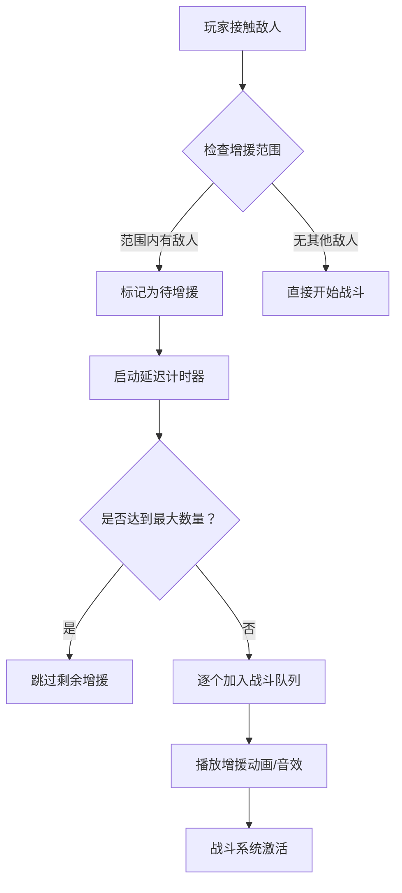

# 🔍 PART 2: 即时探索与触发机制

**章节**: 第二章  
**内容范围**: 玩家移动、接触触发战斗、增援范围机制（核心亮点！）、迷雾系统

---

## 二、即时探索与触发机制

### ⚔️ 2.1 玩家主动控制移动系统

#### 2.1.1 简化版移动实现 (后期优化手感细节)

**设计原则:**  
> "Phase 1 优先保证基本功能可用，操作手感参数后续迭代优化"

```gdscript
class PlayerMovement:
    @export var max_speed := 300.0       # 基础速度 (可调整)
    @export var acceleration := 500.0    # 加速度
    
    var velocity := Vector2.ZERO
    var is_moving := false
    
    func _physics_process(delta):
        # 读取输入
        var input_vector := Vector2(
            Input.get_action_strength("move_right") - 
            Input.get_action_strength("move_left"),
            Input.get_action_strength("move_up") - 
            Input.get_action_strength("move_down")
        )
        
        if input_vector != Vector2.ZERO:
            is_moving = true
            
            # 应用加速度
            velocity.x += input_vector.x * acceleration * delta
            velocity.y += input_vector.y * acceleration * delta
            
            # 限制最大速度
            velocity = velocity.clamped(max_speed)
        else:
            is_moving = false
            velocity = velocity.lerp(Vector2.ZERO, 0.1)

# 后期优化方向 (Phase 2+):
# - 增加摩擦力/减速效果
# - 实现跳跃充能机制
# - 添加动画状态机平滑过渡
```

#### 2.1.2 移动手感参数建议表

| 参数 | Phase 1 初始值 | Phase 2 优化目标 | 说明 |
|------|---------------|-----------------|------|
| **max_speed** | 300 px/s | 200-400 px/s (玩家偏好) | 根据游戏节奏调整 |
| **acceleration** | 500 px/s² | 700 px/s² | 增加启动延迟感 |
| **friction** | 0.1 | 0.3 | 松手后滑行效果 |
| **jump_velocity** | -400 px/s | -450 px/s (充能机制) | 后续扩展跳跃系统 |

---

### 2.2 接触触发战斗逻辑

#### 2.2.1 基础触发机制

**两种触发方式:**

| 触发类型 | 触发条件 | 玩家控制权 | 适用场景 |
|----------|----------|------------|----------|
| **接触触发** | 玩家碰撞体与怪物碰撞体重叠 | 低 (被动) | 随机遭遇战、巡逻怪 |
| **技能拉怪** | 使用特定技能主动吸引敌人 | 高 (主动) | Boss 战、战术配合 |

#### 2.2.2 接触触发实现流程

```gdscript
class EnemyEncounterTrigger:
    var encounter_radius := 32.0  # 碰撞检测半径
    
    func _ready():
        $CollisionShape2D.shape.radius = encounter_radius
        body_entered.connect(_on_body_entered)
    
    func _on_body_entered(body: Node):
        if body.is_in_group("enemy"):
            trigger_encounter(body)

func trigger_encounter(enemy_node: Node):
    # 检查是否已在战斗中
    if battle_manager.is_in_battle():
        return
    
    # 记录触发源敌人
    var source_enemy := enemy_node as EnemyEntity
    
    # 计算增援范围 (核心机制！见 2.3 节)
    var nearby_enemies := find_enemies_in_range(source_enemy.global_position, ENFORCEMENT_RADIUS)
    
    # 将范围内所有敌人都加入战斗队列
    for enemy in nearby_enemies:
        battle_manager.add_enemy_to_battle(enemy)
    
    # 启动回合制战斗流程
    battle_manager.start_turn_based_combat()

# 敌人实体类定义
class EnemyEntity extends CharacterBody2D:
    var enemy_id := ""
    var current_state := ENEMY_STATE.IDLE
    var enforcement_radius := 64.0  # 增援范围半径
    
    func _ready():
        $Area2D.body_entered.connect(_on_area_body_entered)
    
    func _on_area_body_entered(body: Node):
        if body.is_in_group("player"):
            # 玩家进入警戒范围 → 触发战斗
            trigger_alert()

# 警戒状态转换
func trigger_alert():
    if current_state == ENEMY_STATE.IDLE:
        current_state = ENEMY_STATE.ALERTED
        
        # 播放警报动画/音效
        play_alert_animation()
        
        # 检查是否有队友在增援范围内
        var teammates := find_allies_in_group("enemies")
        for ally in teammates:
            if get_distance_to(ally) <= enforcement_radius:
                # 拉入战斗队列
                battle_manager.queue_enemy_for_enforcement(ally)

```

#### 2.2.3 技能拉怪机制 (主动战术)

**技能设计:**

| 技能名称 | 消耗 | 范围 | 冷却时间 | 效果描述 |
|----------|------|------|----------|----------|
| **挑衅之声** | 10 MP | 64px | 8s | 强制范围内敌人攻击玩家 |
| **诱饵烟雾** | 15 MP | 96px | 12s | 制造吸引注意力的烟雾弹 |
| **哨兵号角** | 20 MP | 128px | 15s | 召唤 NPC 队友吸引火力 |

```gdscript
class TauntSkill:
    var skill_id := "taunt_voice"
    var mp_cost := 10
    var range_radius := 64.0
    var cooldown_time := 8.0
    
    func cast_skill():
        if not can_cast():
            return false
        
        # 扣除 MP
        player.mp -= mp_cost
        
        # 创建技能效果区域
        var effect_area := create_taunt_area()
        get_tree().current_scene.add_child(effect_area)
        
        # 标记范围内敌人进入被挑衅状态
        for enemy in find_enemies_in_range(player.global_position, range_radius):
            enemy.apply_taunt_status(player, duration=5.0)
        
        # 启动冷却计时器
        start_cooldown()

# 敌人被挑衅状态处理
func apply_taunt_status(attacker: Node, duration: float):
    current_state = ENEMY_STATE.TAUNTED
    
    # 优先攻击挑衅者
    target_entity := attacker as CharacterBody2D
    
    # 播放受控动画
    play_taunted_animation()

# 冷却时间管理
var cooldown_timer := Timer.new()

func start_cooldown():
    cooldown_timer.start(cooldown_time)
    cooldown_timer.timeout.connect(_on_cooldown_finished)

func _on_cooldown_finished():
    can_cast = true
```

---

### 🔥 2.3 **增援范围机制** ← 核心亮点！独特卖点！

#### 2.3.1 设计理念与玩法价值

**核心价值:**  
> "通过增援范围机制，创造战术决策点：玩家可以选择'逐个击破'或'引怪群殴'"

**设计目标:**
- ✅ **增加策略深度**: 玩家需要规划路线和战斗顺序
- ✅ **风险收益平衡**: 吸引过多敌人可能陷入苦战
- ✅ **鼓励团队协作**: 多人模式下可分工引怪/输出

#### 2.3.2 增援范围参数详解

**基础参数表:**

| 参数名称 | 推荐值 | 可调范围 | 说明与设计理由 |
|----------|--------|----------|----------------|
| **enforcement_radius** | 64px | 32~128px | 以怪物为中心，半径内其他怪物可被拉入战斗 |
| **alert_range_multiplier** | 1.5x | 1.0~2.0x | 警戒状态下的增援范围扩大系数 (巡逻怪触发时生效) |
| **max_enforcement_count** | 3 个 | 1~5 个 | 单次战斗最多激活的增援敌人数量 |
| **enforcement_delay** | 0.5s | 0.2~1.0s | 从触发到增援加入的战斗延迟 (避免瞬间爆发) |

#### 2.3.3 增援拉入战斗完整流程



**详细实现流程:**

```gdscript
class EnforcementManager:
    var enforcement_radius := 64.0
    var max_enforcement_count := 3
    var enforcement_delay := 0.5
    
    # 触发源敌人
    var source_enemy: EnemyEntity = null
    
    # 待增援队列 (FIFO)
    var reinforcement_queue: Array[EnemyEntity] = []
    
    # 已激活的增援数量
    var active_enforcements := 0
    
    func trigger_encounter(source: EnemyEntity):
        source_enemy = source
        
        # 搜索范围内所有敌对单位
        var all_enemies := get_tree().get_nodes_in_group("enemies")
        
        for enemy in all_enemies:
            if enemy == source:
                continue
            
            # 检查距离
            var distance := source.global_position.distance_to(enemy.global_position)
            
            if distance <= enforcement_radius and not enemy.is_in_battle():
                # 加入待增援队列
                reinforcement_queue.append(enemy)
        
        # 启动延迟处理流程
        start_enforcement_delay_timer()

func start_enforcement_delay_timer():
    var delay_timer := Timer.new()
    delay_timer.one_shot = true
    delay_timer.timeout.connect(_on_delay_finished)
    add_child(delay_timer)
    delay_timer.start(enforcement_delay)

func _on_delay_finished():
    # 按顺序激活增援敌人
    while reinforcement_queue.size() > 0 and active_enforcements < max_enforcement_count:
        var next_enemy := reinforcement_queue.pop_front()
        
        # 标记为战斗中状态
        next_enemy.is_in_battle = true
        
        # 播放入场动画 (从战场边缘冲入)
        play_enforcement_entry_animation(next_enemy)
        
        active_enforcements += 1
        
        # 通知战斗系统添加该敌人
        battle_manager.add_enemy_to_turn_order(next_enemy)

# 增援入场动画实现
func play_enforcement_entry_animation(enemy: EnemyEntity):
    var start_position := source_enemy.global_position + Vector2.RIGHT * enforcement_radius
    enemy.global_position = start_position
    
    # 向战场中心移动 (30px/s)
    var move_direction := (source_enemy.global_position - start_position).normalized()
    
    var move_timer := Timer.new()
    move_timer.timeout.connect(_on_move_tick.bind(enemy, move_direction))
    add_child(move_timer)
    move_timer.start(0.1)

func _on_move_tick(enemy: EnemyEntity, direction: Vector2):
    enemy.global_position += direction * 30.0
    
    if enemy.global_position.distance_to(source_enemy.global_position) < 8.0:
        # 到达战场位置 → 停止移动
        enemy.velocity = Vector2.ZERO

# 警戒状态下的范围扩大逻辑
func apply_alert_range_multiplier():
    match source_enemy.current_state:
        ENEMY_STATE.ALERTED:
            enforcement_radius *= alert_range_multiplier  # 1.5x
        
        ENEMY_STATE.PATROLLING:
            enforcement_radius *= (alert_range_multiplier * 0.8)  # 巡逻时范围略小

# 玩家主动规避策略支持
func can_player_avoid_enforcement():
    # 如果玩家处于隐身/潜行状态，可避免触发增援
    if player.is_stealthed:
        return true
    
    # 如果玩家距离足够远，可在敌人警戒前离开
    if source_enemy.global_position.distance_to(player.global_position) > enforcement_radius * 2.0:
        return true
    
    return false

```

#### 2.3.4 增援机制的战术意义分析

**玩家决策树:**

```mermaid
graph TD
    A[发现敌人] --> B{评估风险}
    B -->|单个弱敌 | C[直接战斗 - 低风险高收益]
    B -->|多个强敌 | D{能否逐个击破？}
    D -->|是 | E[利用掩体/距离控制]
    D -->|否 | F[选择撤退/逃跑]
    
    C --> G[触发增援范围检测]
    E --> H[尝试引怪到狭窄区域]
    H --> I{能否有效分割敌人？}
    I -->|是 | J[逐个击破 - 最优解]
    I -->|否 | K[陷入苦战 - 风险高]
    
    G --> L{增援数量过多？}
    L -->|是 | M[立即撤退/使用逃跑技能]
    L -->|否 | N[继续战斗 - 中风险]

# 决策因素权重表:
# - 敌人强度：35%
# - 增援数量：25%
# - 环境优势：20%
# - 玩家状态：15%
# - 任务紧迫度：5%
```

**战术价值体现:**

| 场景 | 策略选择 | 风险等级 | 收益评估 |
|------|----------|----------|----------|
| **遭遇巡逻小队 (3 怪)** | 逐个引离 → 单挑 | ⭐⭐ (中) | 高 (完整经验 + 掉落) |
| **Boss 战前哨** | 主动触发增援 → 群殴 | ⭐⭐⭐ (高) | 极高 (一次性清除威胁) |
| **资源点防守** | 利用掩体分割敌人 | ⭐ (低) | 中 (安全获取资源) |

---

### 2.4 视野/迷雾系统 (Fog of War)

#### 2.4.1 设计目标与实现方案

**核心目标:**
- ✅ **增加探索感**: 未知区域带来紧张感和好奇心
- ✅ **战术决策点**: 玩家需规划路线和视野覆盖
- ✅ **叙事支持**: 可通过迷雾隐藏关键信息 (Boss 位置、稀有资源)

#### 2.4.2 迷雾层级设计

| 迷雾状态 | 可见度 | 触发条件 | 视觉效果 |
|----------|--------|----------|----------|
| **已探索** | 100% 可见 | 玩家曾到达该区域 | 完全显示地图细节 |
| **已知但未探索** | 30% 可见 | 通过侦察/情报得知存在 | 灰色轮廓，无法看清细节 |
| **未知区域** | 0% 可见 (全黑) | 从未接触过的区域 | 全黑遮罩，仅显示玩家周围视野 |

#### 2.4.3 视野范围计算机制

```gdscript
class VisibilitySystem:
    var player_viewport := Vector2(512, 512)  # 玩家视野半径 (像素)
    var fog_of_war_texture := preload("res://textures/fog_of_war.tres")
    
    func update_visibility(player_position: Vector2):
        # 计算可见区域 (圆形范围)
        var visible_area := calculate_visible_circle(player_position, player_viewport)
        
        # 合并到已探索地图数据
        explored_map.merge_with(visible_area)
        
        # 更新迷雾渲染层
        update_fog_overlay(explored_map)

func calculate_visible_circle(center: Vector2, radius: float) -> Rect2:
    return Rect2(
        center - Vector2(radius, radius),
        Vector2(radius * 2, radius * 2)
    )

# 射线投射法实现视野遮挡 (墙壁阻挡视线)
func calculate_visibility_with_obstacles(player_pos: Vector2):
    var visible_tiles := []
    var ray_count := 360  # 360°全向扫描
    
    for angle in range(ray_count):
        var ray_direction := Vector2(cos(deg_to_rad(angle)), sin(deg_to_rad(angle)))
        
        # 发射射线检测障碍物
        var collision := get_ray_cast(player_pos, ray_direction, player_viewport)
        
        if collision:
            # 标记射线覆盖区域为可见
            mark_visible_area(player_pos, collision.position)
        else:
            # 无阻挡 → 视野边缘标记
            mark_visible_area(player_pos, player_pos + ray_direction * player_viewport)

# 迷雾渲染实现 (使用 ShaderMaterial)
class FogOfWarRenderer extends CanvasLayer:
    var fog_texture := Sprite2D.new()
    
    func _ready():
        fog_texture.material = load("res://shaders/fog_of_war_shader.gdshader")
        add_child(fog_texture)
    
    func update_fog_map(explored_tiles: Array[Vector2]):
        # 将探索数据转换为纹理坐标
        var fog_data := convert_explored_to_texture_coordinates(explored_tiles)
        
        fog_texture.material.set_shader_parameter("explored_area", fog_data)

# Shader 代码片段 (用于迷雾渲染)
/*
// fragment shader for fog of war
uniform sampler2D explored_map;
varying vec2 v_uv;

void main() {
    float exploration_factor = texture(explored_map, v_uv).r;
    
    if (exploration_factor < 0.5) {
        // 未探索区域：完全黑色
        gl_FragColor = vec4(0.0, 0.0, 0.0, 1.0);
    } else if (exploration_factor < 0.8) {
        // 已知但未探索：灰色轮廓
        gl_FragColor = vec4(0.3, 0.3, 0.3, 0.7);
    } else {
        // 已探索区域：正常显示
        gl_FragColor = texture(u_texture, v_uv);
    }
}
*/

```

#### 2.4.4 侦察技能与视野扩展

**侦察类技能/物品:**

| 名称 | 类型 | 效果描述 | 冷却时间 |
|------|------|----------|----------|
| **鹰眼术** | 主动技能 | 短时间内扩大视野半径至 2x | 30s |
| **探路者之靴** | 装备道具 | 自动标记周围 128px 内的隐藏路径 | 被动生效 |
| **侦察无人机** | 消耗品 | 派遣无人机探索未知区域 (持续 60s) | 一次性使用 |

```gdscript
class ScoutSkill:
    var skill_name := "eagle_eye"
    var mp_cost := 15
    var duration := 30.0
    
    func activate():
        player_viewport *= 2.0
        
        # 显示技能特效
        show_skill_effect("eagle_eye")
        
        # 启动持续时间计时器
        var timer := Timer.new()
        timer.timeout.connect(_on_skill_expired)
        add_child(timer)
        timer.start(duration)

func _on_skill_expired():
    player_viewport /= 2.0
```

---

**章节完成状态**: ✅ 第二章完整  
**下一步**: PART 3 - 回合制战斗框架
