# 🚀 Phase 2: 详细开发计划与任务分解

**项目名称:** Dungeon Extraction Game  
**版本:** v1.0 (Phase 2)  
**作者:** 中书 🐉 (首席策划官 & 剧情设计大师)  
**日期:** 2026-03-23  

---

## 📋 开发路线图总览

```
Phase 1 (Core Loop Foundation) → Phase 2 (Content Expansion) → Phase 3 (Polish & Launch)
      ↓                              ↓                            ↓
   核心循环                         内容扩展                       打磨发布
   4-6 周                          8-10 周                        4-6 周
```

---

## 🎯 里程碑规划

### Milestone 1: Core Loop Foundation (M1) - **当前阶段**
**目标:** 实现核心玩法循环，可玩性验证  
**周期:** 4-6 周  
**交付物:** 
- ✅ 基地系统 (基础 NPC、建筑升级)
- ✅ 地牢入口机制 (4 个入口解锁流程)
- ✅ 即时探索与战斗触发 (接触/技能拉怪)
- ✅ 回合制战斗框架 (5 属性克制)
- ✅ 资源掉落系统 (5 级稀有度)
- ✅ 撤离倒计时 UI

**验收标准:** 
- 玩家可从基地出发 → 进入地牢 → 探索战斗 → 成功撤离 → 返回基地升级 → 再次出发
- 核心循环完整，无阻塞性 Bug

---

### Milestone 2: Content Expansion (M2) - **下一阶段**
**目标:** 丰富游戏内容，增加策略深度  
**周期:** 8-10 周  
**交付物:** 
- 📦 职业系统 (3 个基础职业 + 转职机制)
- 📦 装备强化系统 (铁匠铺完整功能)
- 📦 NPC 对话树扩展 (至少 5 个关键 NPC，每个 3+ 分支)
- 📦 任务系统 (主线任务 10 章 + 支线任务 20 条)
- 📦 双属性系统 (角色可同时拥有 2 种元素属性)

**验收标准:** 
- 玩家可自由选择职业发展方向
- NPC 对话有叙事价值，非单纯功能提示
- 主线剧情完整，至少包含 3 个主要转折点

---

### Milestone 3: Polish & Launch (M3) - **发布准备**
**目标:** 优化体验，打磨细节，准备上线  
**周期:** 4-6 周  
**交付物:** 
- 🎨 UI/UX 优化 (流畅度提升、视觉反馈增强)
- 🎵 音效与配乐 (战斗 BGM、环境音效、UI 交互音)
- 🐛 Bug 修复与性能优化 (帧率稳定 ≥60 FPS)
- 📱 多平台适配 (PC/移动端)

**验收标准:** 
- 平均帧率 ≥60 FPS，无卡顿感
- 所有 P0/P1 级别 Bug 已修复
- 用户测试满意度 ≥85%

---

## 🔗 系统依赖关系图

```mermaid
graph TD
    A[基地管理系统] --> B[NPC 对话触发]
    A --> C[建筑升级流程]
    
    D[地牢入口机制] --> E[解锁条件检查]
    D --> F[场景切换动画]
    
    G[即时探索系统] --> H[移动控制]
    G --> I[接触触发战斗]
    G --> J[技能拉怪机制]
    
    K[回合制战斗框架] --> L[伤害计算引擎]
    K --> M[属性克制判定]
    K --> N[AI 行为决策]
    
    O[资源掉落系统] --> P[稀有度权重池]
    O --> Q[掉落率动态调整]
    
    R[撤离倒计时 UI] --> S[警告提示逻辑]
    R --> T[超时惩罚机制]
    
    U[NPC 对话系统] --> V[关系阈值检查]
    U --> W[表情动画切换]
    
    X[任务系统] --> Y[主线任务链]
    X --> Z[支线任务池]
    
    A --> B
    D --> E
    G --> H
    K --> L
    O --> P
    R --> S
    U --> V
    X --> Y
    
    style A fill:#e1f5fe
    style D fill:#fff3e0
    style G fill:#f3e5f5
    style K fill:#e8f5e9
    style O fill:#ffebee
    style R fill:#fce4ec
    style U fill:#f1f8e9
    style X fill:#fffde7
```



**依赖说明:**
- **基地管理系统** → 是 NPC 对话和建筑升级的基础，必须先实现
- **地牢入口机制** → 为即时探索提供场景切换支持
- **即时探索系统** → 包含移动控制和战斗触发逻辑
- **回合制战斗框架** → 核心战斗引擎，依赖属性克制判定
- **资源掉落系统** → 需要稀有度权重池作为基础数据
- **撤离倒计时 UI** → 警告提示和惩罚机制需独立模块化

---

## 📋 详细任务分解 (M1: Core Loop Foundation)

### 任务组 1: 基地管理系统 (2.5 周)

| 任务 ID | 任务名称 | 负责人 | 工时预估 | 依赖项 |
|---------|----------|--------|----------|--------|
| **T-001** | NPC 基础数据结构设计 | 策划/程序 | 3 天 | - |
| **T-002** | NPC 关系值系统实现 | 程序 | 4 天 | T-001 |
| **T-003** | 建筑升级逻辑开发 | 程序 | 5 天 | T-001 |
| **T-004** | NPC 对话树 JSON 格式定义 | 策划 | 2 天 | - |
| **T-005** | 对话引擎实现 | 程序 | 5 天 | T-004, T-002 |

**验收标准:** 
- NPC 关系值变化实时反映在 UI 中
- 建筑升级消耗正确扣除，解锁功能正常触发
- NPC 对话树可加载并显示分支选项

---

### 任务组 2: 地牢入口机制 (1.5 周)

| 任务 ID | 任务名称 | 负责人 | 工时预估 | 依赖项 |
|---------|----------|--------|----------|--------|
| **T-006** | 4 个地牢入口场景设计 | 美术/策划 | 3 天 | - |
| **T-007** | 解锁条件检查逻辑 | 程序 | 2 天 | T-001 |
| **T-008** | 场景切换动画实现 | 程序/美术 | 3 天 | T-006 |

**验收标准:** 
- 玩家到达特定建筑等级后，对应地牢入口自动解锁
- 进入地牢时加载界面显示流畅 (≤2s)

---

### 任务组 3: 即时探索与战斗触发 (2.5 周)

| 任务 ID | 任务名称 | 负责人 | 工时预估 | 依赖项 |
|---------|----------|--------|----------|--------|
| **T-009** | 玩家移动控制实现 | 程序 | 3 天 | - |
| **T-010** | 碰撞检测系统开发 | 程序 | 2 天 | T-009 |
| **T-011** | 增援范围机制核心逻辑 | 程序 | 5 天 | T-010 |
| **T-012** | 技能拉怪系统设计 | 策划/程序 | 3 天 | T-011 |
| **T-013** | 迷雾系统实现 | 程序/美术 | 4 天 | T-009 |

**验收标准:** 
- 玩家触碰敌人时立即触发战斗 (响应时间 <0.2s)
- 增援范围检测准确，64px 内敌人可被拉入战斗队列
- 迷雾渲染流畅，视野变化无延迟感

---

### 任务组 4: 回合制战斗框架 (3 周)

| 任务 ID | 任务名称 | 负责人 | 工时预估 | 依赖项 |
|---------|----------|--------|----------|--------|
| **T-014** | 伤害计算公式实现 | 程序 | 2 天 | - |
| **T-015** | 属性克制判定引擎 | 程序 | 2 天 | T-014 |
| **T-016** | AI 行为决策系统 | 程序/策划 | 5 天 | T-015 |
| **T-017** | 状态效果系统 (BURN/FREEZE/STUN等) | 程序 | 3 天 | T-014 |
| **T-018** | 逃跑成功率判定 | 程序 | 2 天 | T-015, T-017 |

**验收标准:** 
- 伤害计算准确，属性克制加成生效 (1.5x/0.75x)
- AI 行为符合预设模式 (Aggressive/Defensive/Tactical/Random)
- 状态效果持续回合数正确，下回合无法行动判定生效

---

### 任务组 5: 资源掉落系统 (2 周)

| 任务 ID | 任务名称 | 负责人 | 工时预估 | 依赖项 |
|---------|----------|--------|----------|--------|
| **T-019** | 稀有度权重池构建 | 策划/程序 | 3 天 | - |
| **T-020** | 掉落率动态调整逻辑 | 程序 | 3 天 | T-019 |
| **T-021** | 物品数据库设计 | 策划 | 2 天 | T-019 |

**验收标准:** 
- Common 掉落率 ≈50%, Legendary 掉落率≈1%
- 玩家幸运属性加成生效 (最大 +20%)

---

### 任务组 6: 撤离倒计时 UI (1.5 周)

| 任务 ID | 任务名称 | 负责人 | 工时预估 | 依赖项 |
|---------|----------|--------|----------|--------|
| **T-022** | 计时器核心逻辑实现 | 程序 | 2 天 | - |
| **T-023** | UI 元素设计与实现 | 美术/程序 | 4 天 | T-022 |
| **T-024** | 音效提示系统 | 程序/音频 | 2 天 | T-023 |

**验收标准:** 
- t≥600s 时屏幕边缘闪烁警告生效
- t≥900s 时倒计时数字颜色渐变动画流畅
- 音效与时间阶段匹配 (低沉警报→急促滴答→高频蜂鸣)

---

## ⚠️ 风险评估与预案

### 风险 1: 增援范围机制性能问题
**概率:** 中  
**影响:** 高  
**描述:** 当地图上敌人数量过多时，实时检测增援范围可能导致帧率下降  

**预案:** 
- **短期优化:** 使用空间划分算法 (四叉树/网格) 减少检测次数
- **长期方案:** 预计算敌人位置缓存，每帧更新而非实时查询

---

### 风险 2: AI 行为过于单一
**概率:** 高  
**影响:** 中  
**描述:** 玩家可能很快发现 AI 的行为模式，降低策略深度  

**预案:** 
- **短期优化:** 增加随机因子 (30% 概率偏离最优决策)
- **长期方案:** 实现学习型 AI，根据玩家习惯调整行为

---

### 风险 3: 经济系统通胀失控
**概率:** 中  
**影响:** 高  
**描述:** 后期金币溢出导致游戏目标感丧失  

**预案:** 
- **短期监控:** 每 24h 收集一次玩家平均金币数量数据
- **长期调控:** 动态需求系统 + 消耗机制 (建筑维护费、NPC 贿赂)

---

### 风险 4: 任务内容不足
**概率:** 高  
**影响:** 中  
**描述:** M1 完成后，玩家可能很快耗尽所有可玩内容  

**预案:** 
- **短期方案:** 优先完成主线任务前 5 章 (约 2 小时流程)
- **长期规划:** 预留支线任务模板，M2 阶段批量填充

---

## 💰 资源需求估算

### 美术资源
| 类别 | 数量 | 预估工时 | 优先级 |
|------|------|----------|--------|
| **基地场景** | 1 个主堡 +6 建筑 | 20 人天 | P0 |
| **地牢入口** | 4 个独立入口 | 15 人天 | P0 |
| **城镇场景** | 1 个集市广场 | 10 人天 | P1 |
| **角色立绘** | 8 个关键 NPC | 12 人天 | P0 |
| **UI 图标** | 50+ 物品/装备图标 | 10 人天 | P0 |

### 程序资源
| 模块 | 负责人 | 工时预估 |
|------|--------|----------|
| 核心战斗引擎 | 主程 A | 40 人天 |
| AI 行为系统 | 副程 B | 25 人天 |
| UI/UX 实现 | UI 程序 C | 20 人天 |

### 音频资源
| 类别 | 数量 | 预估工时 |
|------|------|----------|
| **战斗 BGM** | 3 首 (常规/Boss/胜利) | 5 人天 |
| **环境音效** | 10+ 种 (地牢/城镇/基地) | 8 人天 |
| **UI 交互音** | 20+ 个 (点击/警告/提示) | 3 人天 |

---

## 📊 开发进度追踪模板

```markdown
# [日期] - 开发进度报告

## 已完成任务
- [x] T-001: NPC 基础数据结构设计 ✅
- [ ] T-002: NPC 关系值系统实现 ⏳ (预计完成：3/25)

## 进行中任务
- 🟡 T-005: 对话引擎实现 (进度：60%)
- 🔴 T-011: 增援范围机制核心逻辑 (进度：80%, 风险：性能问题已解决)

## 阻塞问题
- ⚠️ T-023 UI 元素设计与实现 → 美术资源交付延迟 2 天

## 下周计划
1. 完成对话引擎实现并测试
2. 开始回合制战斗框架开发
```

---

## 🐉 Phase 3: 职业系统策划案 (待 M1 完成后启动)

### 三大基础职业

| 职业 | HP | MP | 攻击类型 | 特色技能 | 适合玩家风格 |
|------|-----|-----|----------|----------|--------------|
| **战士** | 高 | 低 | 近战物理 | 冲锋怒吼 (击退周围敌人) | 正面输出、承受伤害 |
| **法师** | 中 | 高 | 远程魔法 | 元素爆发 (范围 AOE 伤害) | 持续输出、AOE 清场 |
| **游侠** | 低 | 中 | 近战/远程混合 | 影遁 (隐身 + 下次攻击暴击) | 灵活走位、单体爆发 |

### 转职条件 (职业等级 Lv.10+)

- **战士 → 骑士:** 完成"守护誓言"任务线，防御力≥200
- **战士 → 狂战:** 累计击杀 Boss 数≥50，攻击力≥300
- **法师 → 贤者:** 掌握所有元素技能，MP 上限≥500
- **法师 → 术士:** 完成"黑暗契约"隐藏任务，智力≥250
- **游侠 → 刺客:** 暴击率≥40%，潜行成功率≥80%
- **游侠 → 猎人:** 远程命中率≥90%，捕获怪物数≥100

---

*中书记忆库 | 策划先行 · 设计驱动*  
*文档版本：v1.0 (Phase 2) | 最后更新：2026-03-23*
