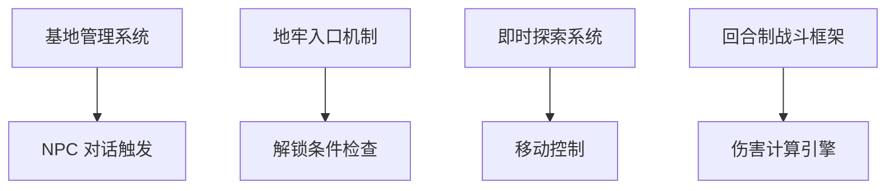

# 🚀 Phase 2: 详细开发计划与任务分解 (讨论草案)

**项目名称:** Dungeon Extraction Game  
**版本:** v1.0 (Phase 2)  
**作者:** 中书 🐉 (首席策划官 & 剧情设计大师)  
**日期:** 2026-03-23  

> **重要提示:** 此文档为**讨论草案**，非最终决策。开发计划应由 BOSS、SHANGSHU、HUISHI 共同评审确定。

---

## 📋 开发路线图总览 (草案)

```
Phase 1 (Core Loop Foundation) → Phase 2 (Content Expansion) → Phase 3 (Polish & Launch)
      ↓                              ↓                            ↓
   核心循环                         内容扩展                       打磨发布
   4-6 周                          8-10 周                        4-6 周
```

---

## 🎯 里程碑规划 (待讨论)

### Milestone 1: Core Loop Foundation (M1) - **当前阶段**
**目标:** 实现核心玩法循环，可玩性验证  
**周期:** 4-6 周  
**验收标准:** 
- 玩家可从基地出发 → 进入地牢 → 探索战斗 → 成功撤离 → 返回基地升级 → 再次出发
- 核心循环完整，无阻塞性 Bug

---

### Milestone 2: Content Expansion (M2) - **下一阶段**
**目标:** 丰富游戏内容，增加策略深度  
**周期:** 8-10 周  
**交付物:** 
- 📦 职业系统 (3 个基础职业 + 转职机制)
- 📦 NPC 对话树扩展 (至少 5 个关键 NPC，每个 3+ 分支)
- 📦 任务系统 (主线任务 10 章 + 支线任务 20 条)

---

### Milestone 3: Polish & Launch (M3) - **发布准备**
**目标:** 优化体验，打磨细节，准备上线  
**周期:** 4-6 周  
**验收标准:** 
- 平均帧率 ≥60 FPS，无卡顿感
- 所有 P0/P1 级别 Bug 已修复

---

## 🔗 系统依赖关系图 (待确认)



---

## 📋 详细任务分解 (M1: Core Loop Foundation - 草案)

### 任务组 1: 基地管理系统 (2.5 周)

| 任务 ID | 任务名称 | 负责人 | 工时预估 | 依赖项 |
|---------|----------|--------|----------|--------|
| **T-001** | NPC 基础数据结构设计 | ? | 3 天 | - |
| **T-002** | NPC 关系值系统实现 | ? | 4 天 | T-001 |
| **T-003** | 建筑升级逻辑开发 | ? | 5 天 | T-001 |

### 任务组 2: 地牢入口机制 (1.5 周)

| 任务 ID | 任务名称 | 负责人 | 工时预估 | 依赖项 |
|---------|----------|--------|----------|--------|
| **T-006** | 4 个地牢入口场景设计 | ? | 3 天 | - |
| **T-007** | 解锁条件检查逻辑 | ? | 2 天 | T-001 |

### 任务组 3: 即时探索与战斗触发 (2.5 周)

| 任务 ID | 任务名称 | 负责人 | 工时预估 | 依赖项 |
|---------|----------|--------|----------|--------|
| **T-009** | 玩家移动控制实现 | ? | 3 天 | - |
| **T-010** | 碰撞检测系统开发 | ? | 2 天 | T-009 |
| **T-011** | 增援范围机制核心逻辑 | ? | 5 天 | T-010 |

### 任务组 4: 回合制战斗框架 (3 周)

| 任务 ID | 任务名称 | 负责人 | 工时预估 | 依赖项 |
|---------|----------|--------|----------|--------|
| **T-014** | 伤害计算公式实现 | ? | 2 天 | - |
| **T-015** | 属性克制判定引擎 | ? | 2 天 | T-014 |

### 任务组 5: 资源掉落系统 (2 周)

| 任务 ID | 任务名称 | 负责人 | 工时预估 | 依赖项 |
|---------|----------|--------|----------|--------|
| **T-019** | 稀有度权重池构建 | ? | 3 天 | - |

### 任务组 6: 撤离倒计时 UI (1.5 周)

| 任务 ID | 任务名称 | 负责人 | 工时预估 | 依赖项 |
|---------|----------|--------|----------|--------|
| **T-022** | 计时器核心逻辑实现 | ? | 2 天 | - |

---

## ⚠️ 风险评估与预案 (待团队评审)

### 风险 1: 增援范围机制性能问题
**概率:** 中  
**影响:** 高  

**预案:** 
- **短期优化:** 使用空间划分算法减少检测次数

---

## 💰 资源需求估算 (待确认)

| 类别 | 数量 | 预估工时 | 优先级 |
|------|------|----------|--------|
| **基地场景** | 1 个主堡 +6 建筑 | 20 人天 | P0 |
| **地牢入口** | 4 个独立入口 | 15 人天 | P0 |

---

## 📝 下一步行动 (待 BOSS 确认)

1. **团队评审:** SHANGSHU、HUISHI 审阅此草案
2. **任务分配:** 确定每个任务的负责人和工时预估
3. **优先级调整:** 根据资源情况调整开发顺序
4. **最终决策:** BOSS 拍板最终版本

---

*中书记忆库 | 策划先行 · 设计驱动*  
*文档状态：**讨论草案** | 最后更新：2026-03-23*
